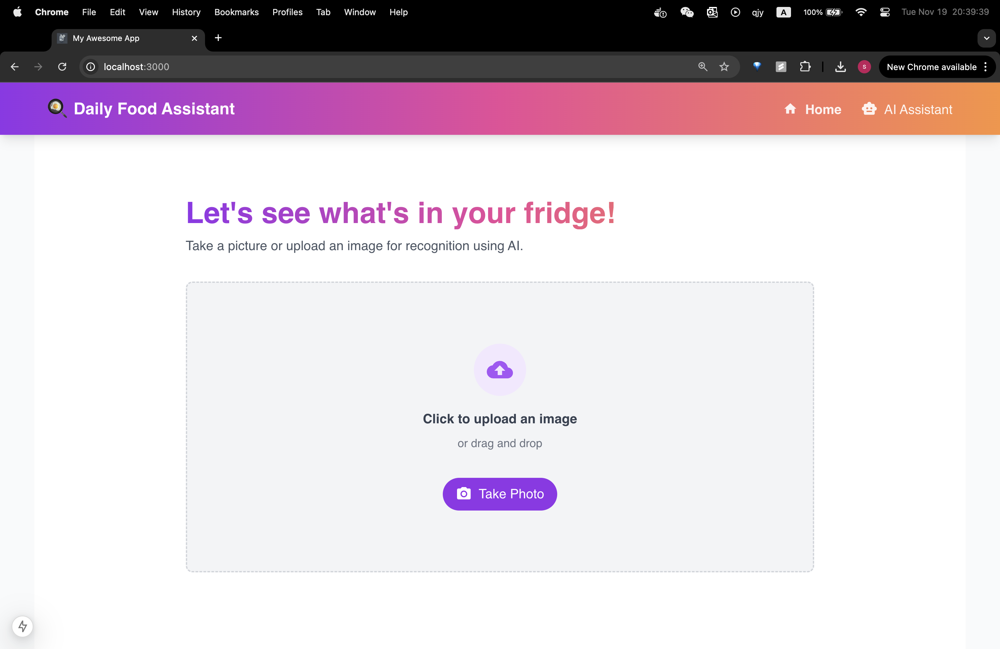
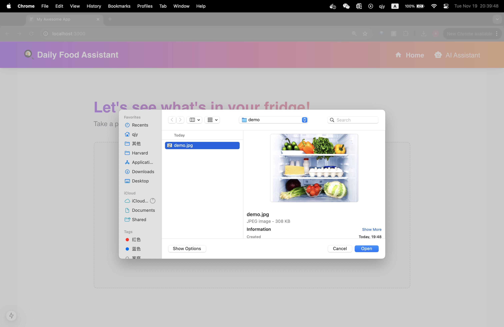
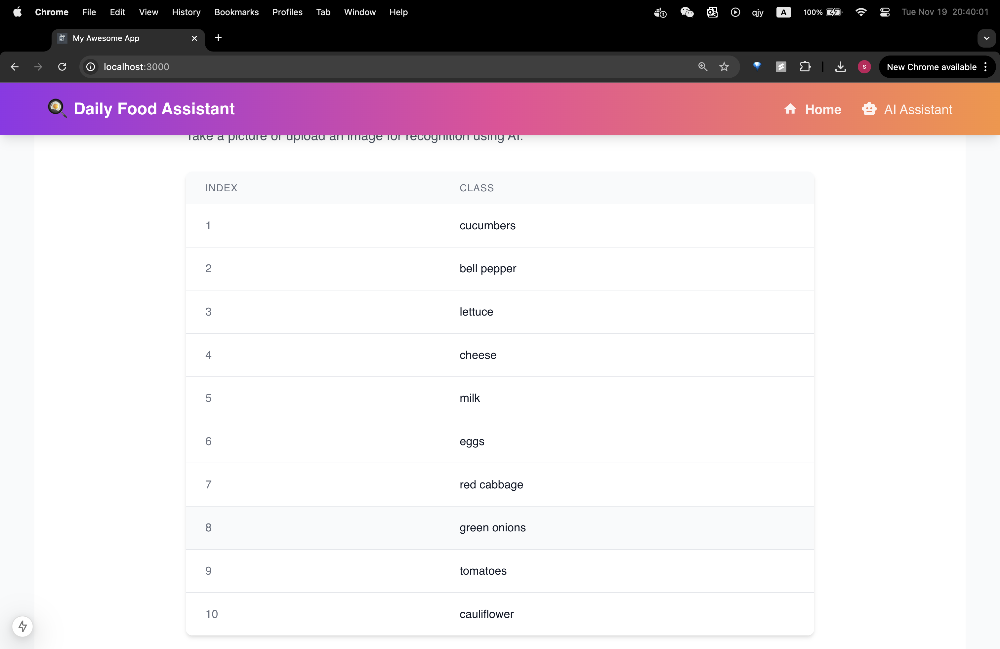
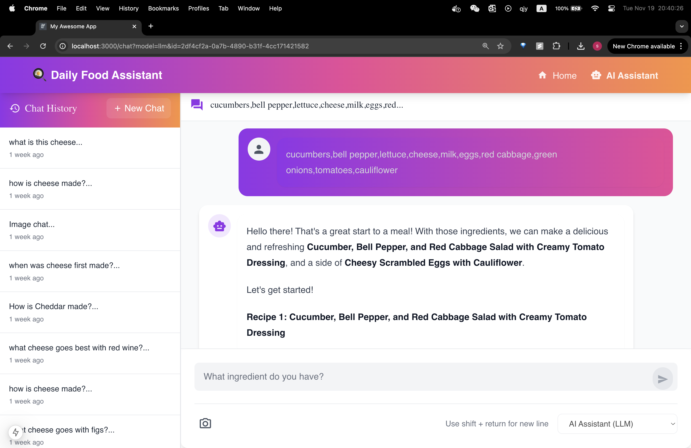
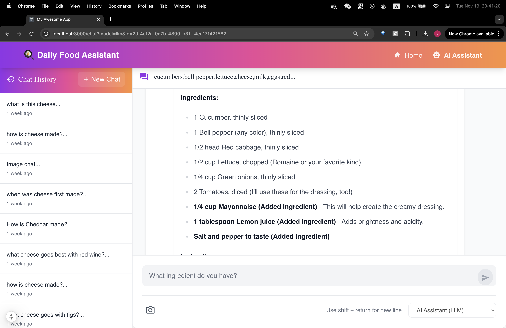
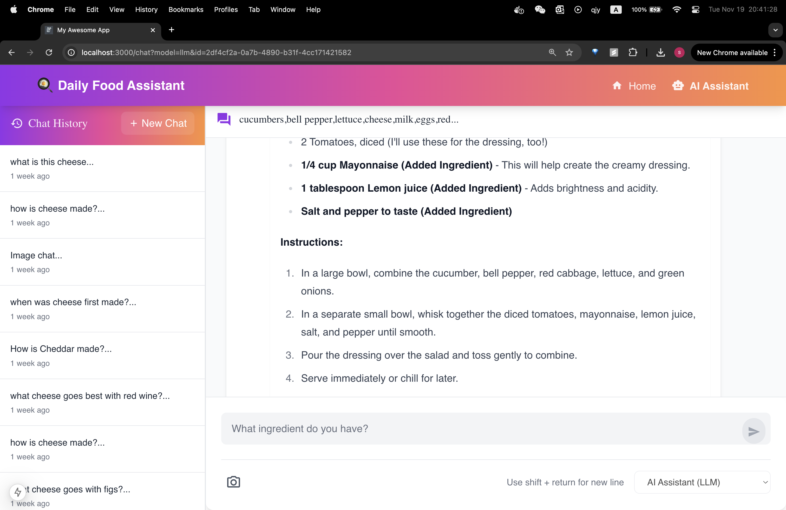
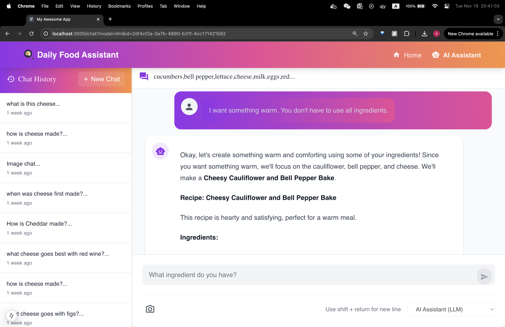

#### Project Milestone 4 Organization

```
├── .dvc
│   ├── .gitignore
│   ├── cache
│   │   └── files
│   ├── config
│   ├── config.local
│   └── tmp
│       ├── btime
│       ├── lock
│       ├── rwlock
│       ├── rwlock.lock
│       ├── updater
│       └── updater.lock
├── .dvcignore
├── .git
│   ├── COMMIT_EDITMSG
│   ├── FETCH_HEAD
│   ├── HEAD
│   ├── ORIG_HEAD
│   ├── branches
│   ├── config
│   ├── description
│   ├── hooks
│   ├── index
│   ├── info
│   │   └── exclude
│   ├── logs
│   │   ├── HEAD
│   │   └── refs
│   ├── objects
│   ├── packed-refs
│   └── refs
│       ├── heads
│       ├── remotes
│       └── tags
├── .gitignore
├── LICENSE
├── README.md
├── data
│   ├── recipe_qa.csv
│   └── recipe_qa.csv.dvc
├── midterm_presentation
│   ├── slides.pdf
│   └── slides.pptx
├── notebooks
│   ├── Object_detection_documentation.md
│   ├── container.ipynb
│   ├── dvc_retrieval.ipynb
│   ├── eda.ipynb
│   ├── fig_container
│   │   └── rag_container.png
│   ├── fig_llm_performance
│   │   ├── raw-rag3-1.png
│   │   ├── raw_rag1-1.png
│   │   ├── raw_rag1-2.png
│   │   ├── raw_rag1-3.png
│   │   ├── raw_rag2-1.png
│   │   ├── raw_rag2-2.png
│   │   └── raw_rag3-2.png
│   ├── food
│   │   ├── food1.jpg
│   │   ├── food1_gemini.png
│   │   ├── food1_gpt.png
│   │   ├── food1_mediapipe.png
│   │   ├── food1_yolov8.png
│   │   ├── food2.png
│   │   ├── food2_gemini.png
│   │   ├── food2_gpt.png
│   │   ├── food2_mediapipe.png
│   │   ├── food2_yolov8.png
│   │   ├── food3.jpg
│   │   ├── food3_gemini.png
│   │   ├── food3_gpt.png
│   │   ├── food3_mediapipe.png
│   │   └── food3_yolov8.png
│   └── llm_performance.ipynb
├── references
│   └── .gitkeep
├── reports
│   ├── Daily Meal Assistant Prototype.pdf
│   ├── Prototype_v2.pdf
│   └── Project Description.pdf
└── src
    ├── data-versioning
    │   ├── .gitignore
    │   ├── Dockerfile
    │   ├── Pipfile
    │   ├── Pipfile.lock
    │   ├── README.md
    │   ├── docker-entrypoint.sh
    │   └── docker-shell.sh
    ├── datapipeline
    │   ├── .gitignore
    │   ├── Dockerfile
    │   ├── Pipfile
    │   ├── Pipfile.lock
    │   ├── cli_rag.py
    │   ├── docker-compose.yml
    │   ├── docker-entrypoint.sh
    │   ├── docker-shell.sh
    │   ├── input-datasets
    │   ├── outputs
    │   └── requirements.txt
    ├── food-detection
    │   ├── Dockerfile
    │   ├── Pipfile
    │   ├── data
    │   ├── docker-compose.yml
    │   ├── docker-shell.sh
    │   ├── gemini-object-detection.py
    │   ├── gpt-object-detection.py
    │   └── requirements.txt
    └── secrets
        └── .gitkeep
```

# AC215 - Milestone4 - Daily Meal Assistant - "What to Eat Today"

Archived `README.md` in Milestone3 can be found [here](https://github.com/cassied22/AC215_Dashers/tree/milestone3).

**Team Members**

Hanqi(Hanna) Zeng(hanqizeng@hsph.harvard.edu)  <br/> 
Chris Wang(ywang3@hsph.harvard.edu)   <br/> 
Selina Qian(jingyun_qian@hsph.harvard.edu) <br/> 
Shiyu Ma(shiyuma@g.harvard.edu)  <br/> 
Cassie Dai(cdai@g.harvard.edu) <br/> 


**Group Name**
Dashers

**Project**
In this project, we aim to develop an app that serves as a personal meal assistant, helping users track their available ingredients, suggest healthy recipes, and recommend nearby restaurants based on user preferences and current inventory. The app will combine advanced AI tools like object detection and large language models (LLMs) to provide tailored meal recommendations and route suggestions for dining out. <br/>

----
### Milestone4 ###

In this milestone, we have the components for frontend, API service, also components from previous milestones for data management, including versioning, as well as the computer vision and language models.

After completions of building a robust ML Pipeline in our previous milestone we have built a backend api service and frontend app. This will be our user-facing application that ties together the various components built in previous milestones.

**Application Design**

Before we start implementing the app we built a detailed design document outlining the application’s architecture. We built a Solution Architecture and Technical Architecture to ensure all our components work together.

Here is our Solution Architecture:


Here is our Technical Architecture:


**Backend API**

We built backend api service using fast API to expose model functionality to the frontend. The backend includes three APIs: the Food Detection GPT API, the LLM Chat API, and the LLM-RAG Chat API. Each of these APIs supports both GET and POST methods for fetching and storing chat histories. Below is a screenshot of the FastAPI documentation displaying all the available endpoints. To setup the API documentation, you can follow the instructions [here](#setup-instructions).


**Frontend**

A user friendly React app was built to identify various food ingredients in the photot you provided using GPT models and Gemini models from the backend. Using the app, a user can take a picture of the fridge and upload it. The app will send the image to the backend GPT api to recognize all the food ingredients. After edition and confirmation from the user, the ingredients list will be sent to the backend Gemini LLM api to generate recipes of user preference. If the user have additional requirements, the app has a chatbox to extend the conversation and provide more responses.
Essentially, there are 2 components in our App:

1. The Image Recognition Component
    In the path: /Users/qjy/Harvard/2024fall/ac215/AC215_Dashers/src/frontend_react/src/components/image
    We used ImageClassificationPredict to connect with GPT api to recognize ingredients from photos and output a list of food ingredients.
2. The LLM Chat Component
    In the path: /Users/qjy/Harvard/2024fall/ac215/AC215_Dashers/src/frontend_react/src/app/chat
    We used StartChatWithLLM to take food ingredients from the image recognition component as input and generate the recommended recipes. Then, we used ContinueChatWithLLM to generate further conversations entered by user in the chat box.
More components (chat history) will be finalized in the next milestone.


Here are some screenshots of our app:
The start of the page: click on "Get Started" to go to the image upload page.

Upload image here:


See the results here:

Get recipe in the chat box page:

See the sample recipies and detail use of ingredients:


Continue chatting with the AI for additional requirements:


**CI and Test**

We have a functioning CI pipeline that runs on every push or merge. It does automated build process and code quality checks using linting tools (Flake8) running on GitHub Actions. Also, the CI pipeline runs automated testing by executing unit, integration, and systems tests with test results reported.

See the detailed description of Test [here](https://github.com/cassied22/AC215_Dashers/edit/milestone4/tests). 


## Setup Instructions
### Build Recipe Vector Database
Navigate to src/datapipeline directory:
```bash
cd src/datapipeline
```
Build container:
```bash
sh docker-shell.sh
```
Run cli_rag.py to download recipe vector database and build Chromadb:
```bash
python cli_rag.py --download --load
```
Note: Keep this container running while proceding to the next container.
### Run API Server
Navigate to src/api-service:
```bash
cd src/api-service
```
Build container:
```bash
sh docker-shell.sh
```
Start server:
```bash
uvicorn-server
```
Note: Keep this container running while proceding to the next container.
### Run Frontend 
Navigate to src/frontend_react:
```bash
cd src/frontend_react
```
Build container:
```bash
sh docker-shell.sh
```
Start frontend:
```bash
npm install
npm run dev
```


----

**Notebooks/Reports**
This folder contains code that is not part of container - for e.g: Application mockup, EDA, any 🔍 🕵️‍♀️ 🕵️‍♂️ crucial insights, reports or visualizations.

