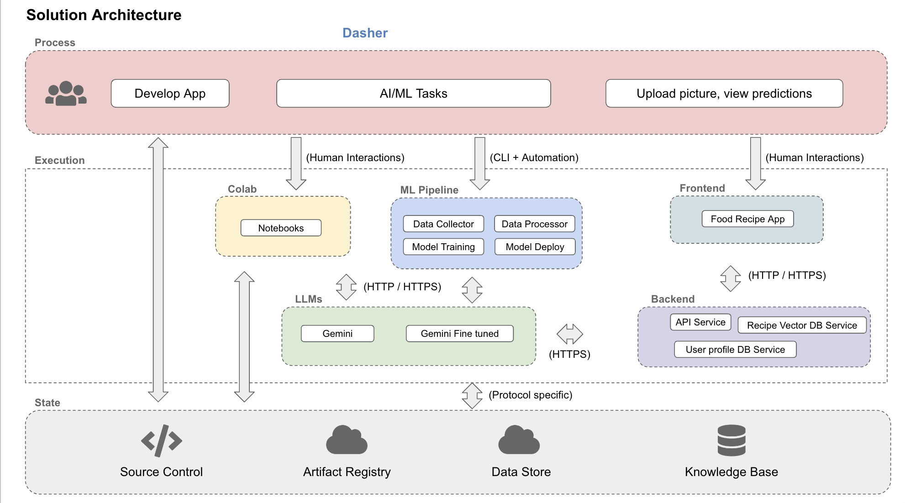
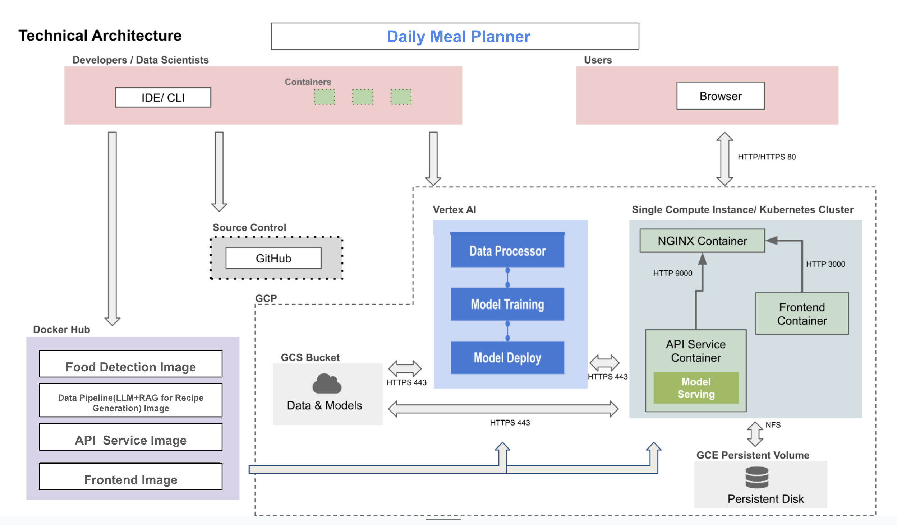
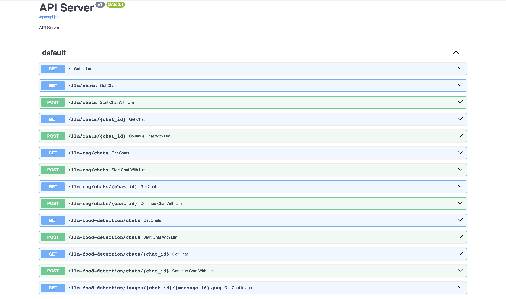

#### Project Milestone 4 Organization

```
├── .dvc
│   ├── .gitignore
│   ├── cache
│   │   └── files
│   ├── config
│   ├── config.local
│   └── tmp
│       ├── btime
│       ├── lock
│       ├── rwlock
│       ├── rwlock.lock
│       ├── updater
│       └── updater.lock
├── .dvcignore
├── .git
│   ├── COMMIT_EDITMSG
│   ├── FETCH_HEAD
│   ├── HEAD
│   ├── ORIG_HEAD
│   ├── branches
│   ├── config
│   ├── description
│   ├── hooks
│   ├── index
│   ├── info
│   │   └── exclude
│   ├── logs
│   │   ├── HEAD
│   │   └── refs
│   ├── objects
│   ├── packed-refs
│   └── refs
│       ├── heads
│       ├── remotes
│       └── tags
├── .gitignore
├── LICENSE
├── README.md
├── data
│   ├── recipe_qa.csv
│   └── recipe_qa.csv.dvc
├── midterm_presentation
│   ├── slides.pdf
│   └── slides.pptx
├── notebooks
│   ├── Object_detection_documentation.md
│   ├── container.ipynb
│   ├── dvc_retrieval.ipynb
│   ├── eda.ipynb
│   ├── fig_container
│   │   └── rag_container.png
│   ├── fig_llm_performance
│   │   ├── raw-rag3-1.png
│   │   ├── raw_rag1-1.png
│   │   ├── raw_rag1-2.png
│   │   ├── raw_rag1-3.png
│   │   ├── raw_rag2-1.png
│   │   ├── raw_rag2-2.png
│   │   └── raw_rag3-2.png
│   ├── food
│   │   ├── food1.jpg
│   │   ├── food1_gemini.png
│   │   ├── food1_gpt.png
│   │   ├── food1_mediapipe.png
│   │   ├── food1_yolov8.png
│   │   ├── food2.png
│   │   ├── food2_gemini.png
│   │   ├── food2_gpt.png
│   │   ├── food2_mediapipe.png
│   │   ├── food2_yolov8.png
│   │   ├── food3.jpg
│   │   ├── food3_gemini.png
│   │   ├── food3_gpt.png
│   │   ├── food3_mediapipe.png
│   │   └── food3_yolov8.png
│   └── llm_performance.ipynb
├── references
│   └── .gitkeep
├── reports
│   ├── Daily Meal Assistant Prototype.pdf
│   ├── Prototype_v2.pdf
│   └── Project Description.pdf
└── src
    ├── data-versioning
    │   ├── .gitignore
    │   ├── Dockerfile
    │   ├── Pipfile
    │   ├── Pipfile.lock
    │   ├── README.md
    │   ├── docker-entrypoint.sh
    │   └── docker-shell.sh
    ├── datapipeline
    │   ├── .gitignore
    │   ├── Dockerfile
    │   ├── Pipfile
    │   ├── Pipfile.lock
    │   ├── cli_rag.py
    │   ├── dataloader.py
    │   ├── docker-compose.yml
    │   ├── docker-entrypoint.sh
    │   ├── docker-shell.sh
    │   ├── input-datasets
    │   ├── outputs
    │   ├── preprocess_cv.py
    │   └── requirements.txt
    ├── food-detection
    │   ├── Dockerfile
    │   ├── Pipfile
    │   ├── data
    │   ├── docker-compose.yml
    │   ├── docker-shell.sh
    │   ├── gemini-object-detection.py
    │   ├── gpt-object-detection.py
    │   └── requirements.txt
    ├── llm_finetuning
    │   ├── .gitignore
    │   ├── README.md
    │   ├── dataset-creator
    │   ├── env.dev
    │   ├── gemini-finetuner
    │   └── images
    ├── models
    │   ├── Dockerfile
    │   ├── docker-shell.sh
    │   ├── infer_model.py
    │   ├── model_rag.py
    │   └── train_model.py
    └── secrets
        └── .gitkeep
```

# AC215 - Milestone4 - Daily Meal Assistant - "What to Eat Today"

Archived `README.md` in Milestone3 can be found [here](https://github.com/cassied22/AC215_Dashers/tree/milestone3).

**Team Members**

Hanqi(Hanna) Zeng(hanqizeng@hsph.harvard.edu)  <br/> 
Chris Wang(ywang3@hsph.harvard.edu)   <br/> 
Selina Qian(jingyun_qian@hsph.harvard.edu) <br/> 
Shiyu Ma(shiyuma@g.harvard.edu)  <br/> 
Cassie Dai(cdai@g.harvard.edu) <br/> 


**Group Name**
Dashers

**Project**
In this project, we aim to develop an app that serves as a personal meal assistant, helping users track their available ingredients, suggest healthy recipes, and recommend nearby restaurants based on user preferences and current inventory. The app will combine advanced AI tools like object detection and large language models (LLMs) to provide tailored meal recommendations and route suggestions for dining out. <br/>

----
### Milestone4 ###

In this milestone, we have the components for frontend, API service, also components from previous milestones for data management, including versioning, as well as the computer vision and language models.

After completions of building a robust ML Pipeline in our previous milestone we have built a backend api service and frontend app. This will be our user-facing application that ties together the various components built in previous milestones.

**Application Design**

Before we start implementing the app we built a detailed design document outlining the application’s architecture. We built a Solution Architecture and Technical Architecture to ensure all our components work together.

Here is our Solution Architecture:



Here is our Technical Architecture:




**Backend API**

We built backend api service using fast API to expose model functionality to the frontend. We also added apis that will help the frontend display some key information about the model and data. 



**Frontend**

A user friendly React app was built to identify various species of mushrooms in the wild using computer vision models from the backend. Using the app a user can take a picture of a mushroom and upload it. The app will send the image to the backend api to get prediction results on weather the mushroom is poisonous or not. 

Here are some screenshots of our app:

```Add screenshots here```

## Running Dockerfile
Instructions for running the Dockerfile can be added here.
To run Dockerfile - `Instructions here`


**Notebooks/Reports**
This folder contains code that is not part of container - for e.g: Application mockup, EDA, any 🔍 🕵️‍♀️ 🕵️‍♂️ crucial insights, reports or visualizations.

----
