# AC215 - Milestone5 - Daily Meal Assistant - "What to Eat Today"

**Team Members**

Hanqi(Hanna) Zeng(hanqizeng@hsph.harvard.edu)  <br/> 
Chris Wang(ywang3@hsph.harvard.edu)   <br/> 
Selina Qian(jingyun_qian@hsph.harvard.edu) <br/> 
Shiyu Ma(shiyuma@g.harvard.edu)  <br/> 
Cassie Dai(cdai@g.harvard.edu) <br/> 


**Group Name**
Dashers

**Project**
In this project, we aim to develop an app that serves as a personal meal assistant, helping users track their available ingredients, suggest healthy recipes, and recommend nearby restaurants based on user preferences and current inventory. The app will combine advanced AI tools like object detection and large language models (LLMs) to provide tailored meal recommendations and route suggestions for dining out. <br/>

----
### Milestone5 ###

In this final milestone, we focus on three key areas:
- Production-ready deployment with Kubernetes and Ansible.
- Project demonstration and documentation.
- Public communication of results through a live showcase.

## Prerequisites and Setup Instructions
Several prerequisites:
- Several secrets and keys: `llm-service-account.json`, `gcp-service.json`, `openai-key.json`
- HavenNeccessary roles and APIs enabled on GCP service account
- Public SSH keys: `ssh-key-deployment.pub`

### SSH Setup
Run the following within the `deployment` container:
```sh
gcloud compute project-info add-metadata --project brilliant-lens-421801 --metadata enable-oslogin=TRUE
# Provide SSH key for service account
cd /secrets
ssh-keygen -f ssh-key-deployment
cd /app
# Provide public SSH key to instances
gcloud compute os-login ssh-keys add --key-file=/secrets/ssh-key-deployment.pub
```
From the output of the above command, keep note of the username, and paste it to `inventory.yml` within `src/deployment` folder.

### Local Development Setup
#### Build Recipe Vector Database
```bash
# Navigate to src/datapipeline directory:
cd src/datapipeline
# Build container and go to the docker shell
sh docker-shell.sh
# Run cli_rag.py within shell to download recipe vector database and build Chromadb
python cli_rag.py --download --load
```
Note: Keep this container running while proceding to the next container.
#### Run API Server
```bash
# Navigate to src/api-service
cd src/api-service
# Build container and go to the docker shell
sh docker-shell.sh
# Start server
uvicorn_server
```
Note: Keep this container running while proceding to the next container.
#### Run Frontend 
```bash
# Navigate to src/frontend_react
cd src/frontend_react
# Build container and go to the docker shell
sh docker-shell.sh
# Start frontend
npm install
npm run dev
```

## Deployment instructions
### GCP Virtual Machine Deployment
Navigate to `src/deployment` folder. Then:
```sh
sh docker-shell.sh
# Upload docker images to Google Cloud Registra, if running the procedure for the first time
ansible-playbook deploy-register-docker-images.yml -i inventory.yml
# Create GCP Virtual Machine compute instance 
ansible-playbook deploy-create-instance.yml -i inventory.yml --extra-vars cluster_state=present
```
Once the command runs successfully get the IP address of the compute instance from GCP Console and update the `appserver>hosts` in `inventory.yml` file
```sh
# Provision compute instance in GCP, installing and setting up required things for deployment
ansible-playbook deploy-provision-instance.yml -i inventory.yml
# Set up docker containers in the compute instance
ansible-playbook deploy-setup-containers.yml -i inventory.yml
# Set up webserver on compute instance
ansible-playbook deploy-setup-webserver.yml -i inventory.yml
```
You can use the below command to view the `EXTERNAL IP` of the your VM, and go to `http://<EXTERNAL IP>/` to view your website.
```sh
gcloud compute instances list
```
**Remember** to delete the compute instance if you don't need the compute instance later.
```sh
ansible-playbook deploy-create-instance.yml -i inventory.yml --extra-vars cluster_state=absent
```
### Kubernetes Deployment
After pushing all docker images to GCR as in the last step, run the following code to setup kubernetes cluster and deploy all containers
```sh
# Set up a kubernetes cluster
ansible-playbook deploy-k8s-create-cluster.yml -i inventory.yml --extra-vars cluster_state=present
# Deploy containers on kubernetes cluster
ansible-playbook deploy-k8s-setup-containers.yml -i inventory.yml --extra-vars cluster_state=present
```
Copy the `nginx_ingress_ip` from the terminal from the create cluster command, and go to `http://<nginx_ingress_ip>.sslip.io` to view the website.
**Remember** to delete the kubernetes cluster if you don't need it later.
```sh
ansible-playbook deploy-k8s-create-cluster.yml -i inventory.yml --extra-vars cluster_state=absent
```


## Usage details and examples
We have deployed our application at [http://35.188.13.243/](http://34.136.111.103.sslip.io/) for all users to try out. 

To run the application locally, please refer to the Prerequisites and Setup Instructions above.

Our application offers a smart solution for daily meal planning from a single image. Key features include:

- Ingredients Detection: Automatically identify ingredients in the uploaded image.
- Recipe Generation: Generate personalized recipes based on detected ingredients.
- Interactive AI Chat Agent: Allow user to refine and customize generated recipes through an intuitive chat interface with our AI agent.
- Video Demonstration: Provide users with option to watch step-by-step video instructions for cooking the generated recipes.
- Restaurant Search: Allow users to search for nearby restaurants instead if they are not in the mood to cook.

Our platform is designed to streamline the cooking experience, whether users are looking to create a meal from scratch or dine out conveniently.

### Example Usage:

#### Example 1: The start of the page: click on "Get Started" to go to the image upload page.


Upload an image of a refridgerator filled with raw ingredients:

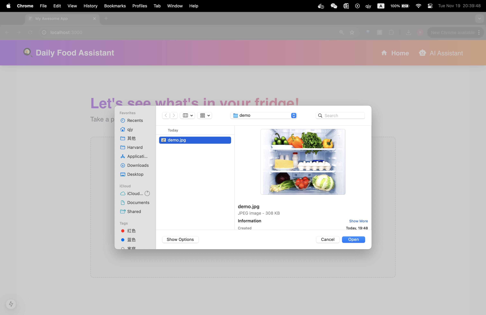

See the list of detected results here. We have two AI assistants to choose from: the LLM without RAG and LLM with RAG; this time we can try the LLM without RAG, click on the "AI Assistant(LLM)" and proceed:

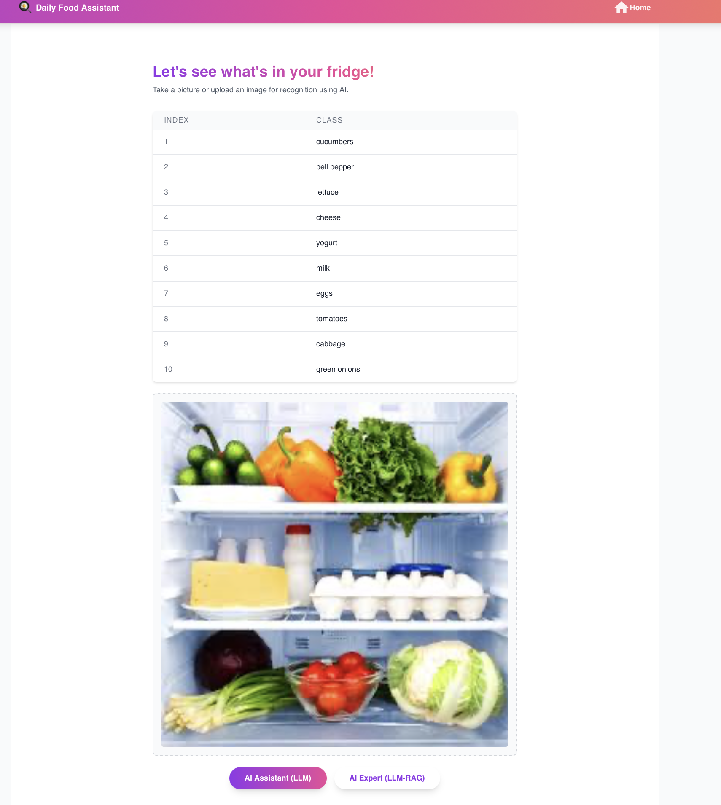

get recipe in the chat box page, check the generated recipe and detail use of ingredients:
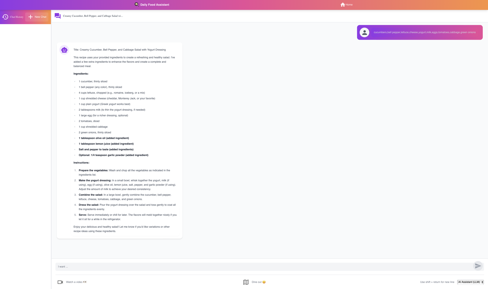

Click on the 'Watch a Video' button on the buttom left corner of the chat page above, get the searched results for youtube videos and blog posts related to the generated recipe:
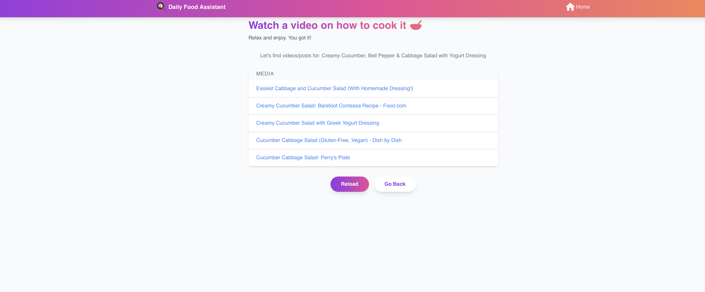

You can always click reload below to get different search results:
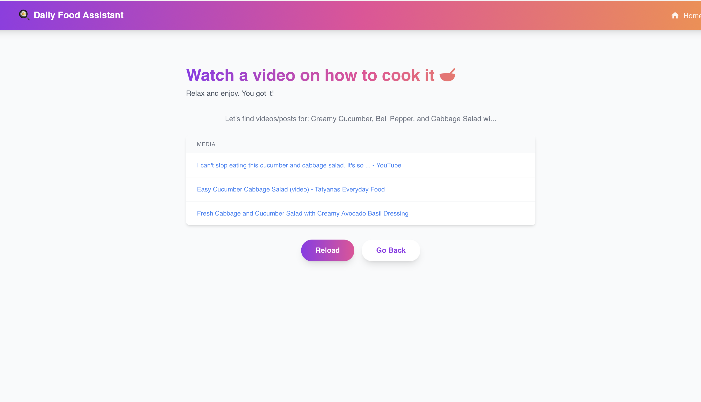

Click on the first search result link, and watch the video on youtube about how to make your dish: 


Example 2: The start of the page: click on "Get Started" to go to the image upload page.

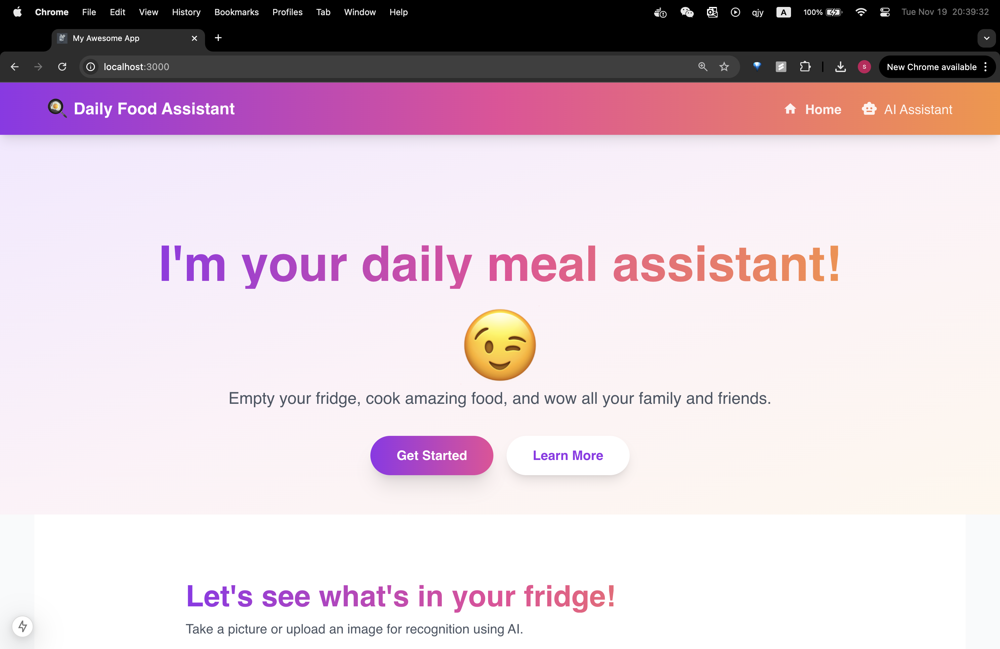

Upload an image of a dish to learn the ingredients and how to cook it:
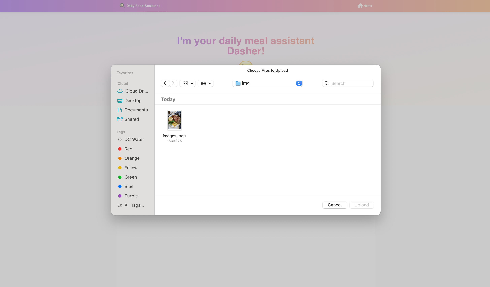


See the identified ingredients here and click on the AI expert this time to proceed:
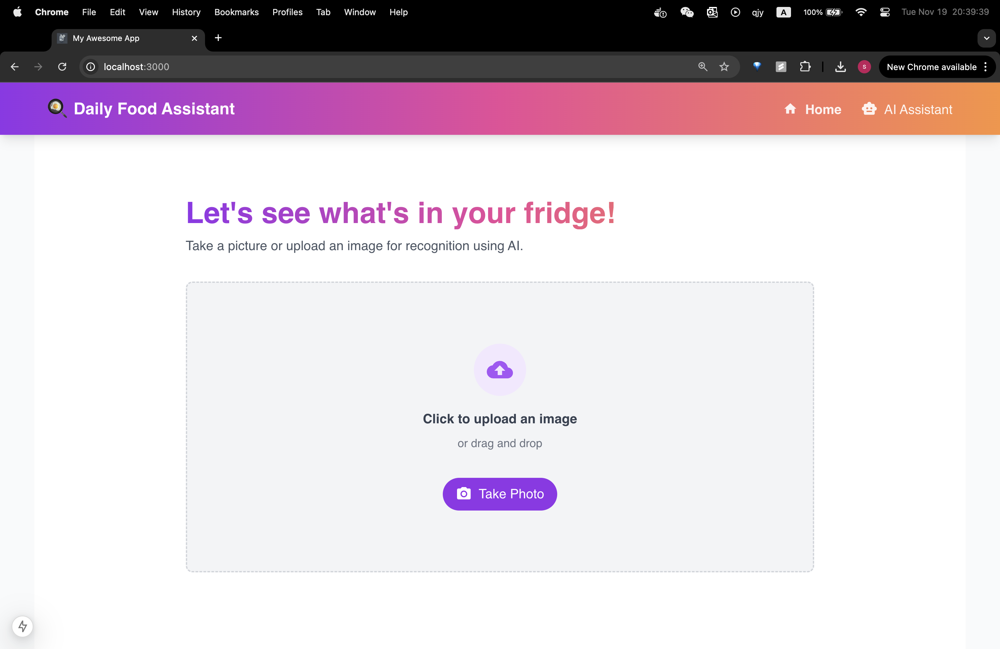

Get recipe in the chat box page, check the generated recipe and detail use of ingredients:

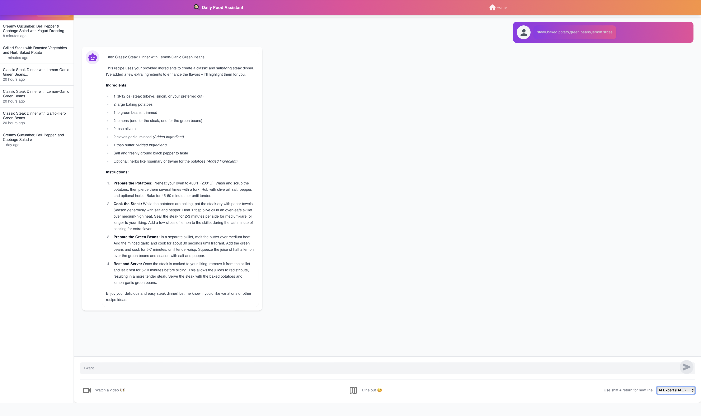

Continue chatting with the AI assistant to refine the recipe based on your personal preference:

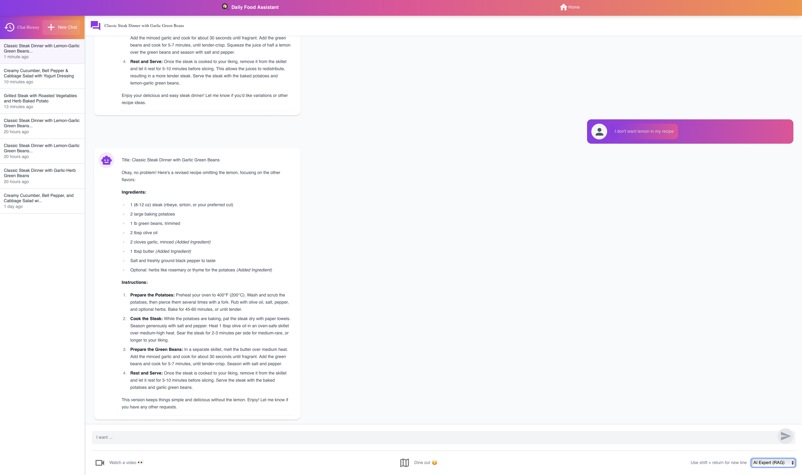


If you do not feel like cooking yourself, click on the Dine Out Button at the bottom of the chat page and you will be able search for restaurants on Google Map as below 
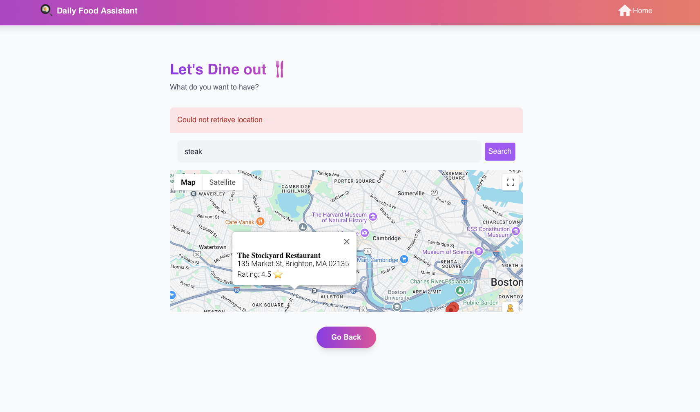


## Known issues and limitations
Here are a few limitations we've identified in the current version of our application:
 1. Geolocation Restrictions: Our deployed public website currently cannot retrieve the user's real-time location when using the Google Maps feature. This limitation arises because the site is deployed over HTTP rather than HTTPS, restricting access to sensitive browser features like the Geolocation API for security and privacy reasons. However, running the application locally allows accurate location retrieval.
 2. RAG LLM Flexibility: We've observed that the RAG-empowered LLM can sometimes be less flexible due to its reliance on a specific database. To address this, we plan to implement customized databases for each user to enhance the accuracy and relevance of RAG-based suggestions in the future.
 3. User Preference Profiling: While we track user preferences to some extent through chat history, we haven't yet implemented a comprehensive system to build a holistic preference profile for each user at the start of a new chat. This can lead to less ideal initial recipe suggestions, requiring more interaction between the user and the AI assistant to refine the recommendations.

## Technical Implementation

### CI and Test

We have a functioning CI pipeline implemented using GitHub Actions that:
- runs unit tests across every container
- runs integration tests across the exposed API
- deploys updates to the Kubernetes cluster
- achieves test coverage over 70% of the lines 
  
on every pull request or merge to the main branch.

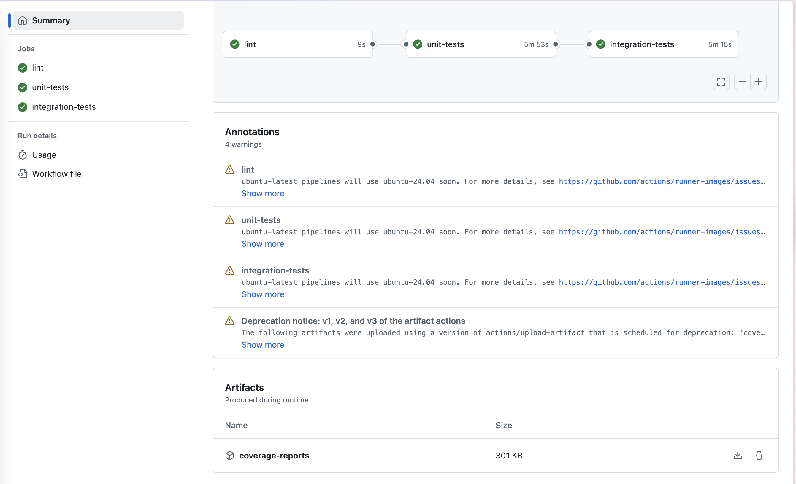

#### Unit Tests: 
We write unit tests for all the Python scripts in our repo, including the source code for each component(container) and the scripts to deploy API endpoints. 
We achieved code coverage of **over 90%** on unit test based on the coverage report below. One lack of testing function is ```test_download()``` in datapipeline inside ```cli_rag.py``` because its too hard to put it running in the CI. Comparing the gcloud storage command arguments is tricky - even though the commands look identical ("Expected: run(['gcloud', 'storage', 'cp', 'outputs/recipe_embeddings.jsonl', 'gs://****/recipe_embeddings.jsonl'], check=True)" vs the actual call), there might be subtle differences in how the strings are formatted or compared by the mock object. All other functions and modules are tested.

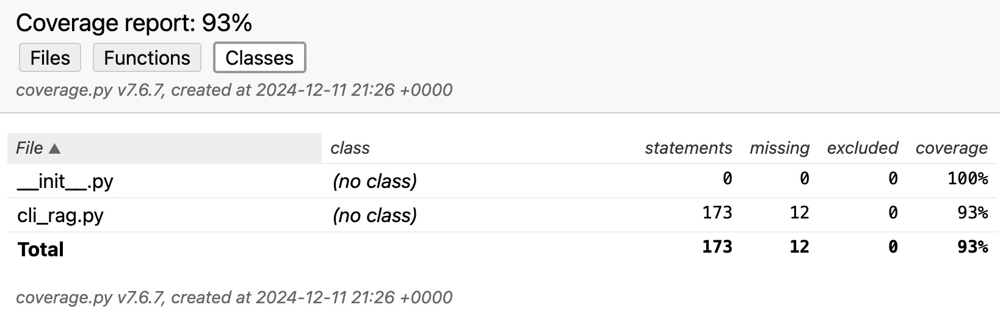
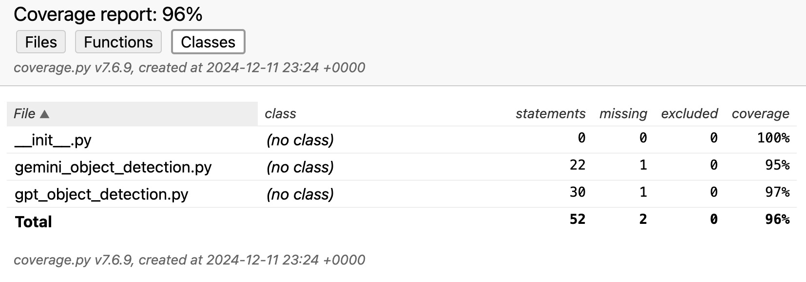
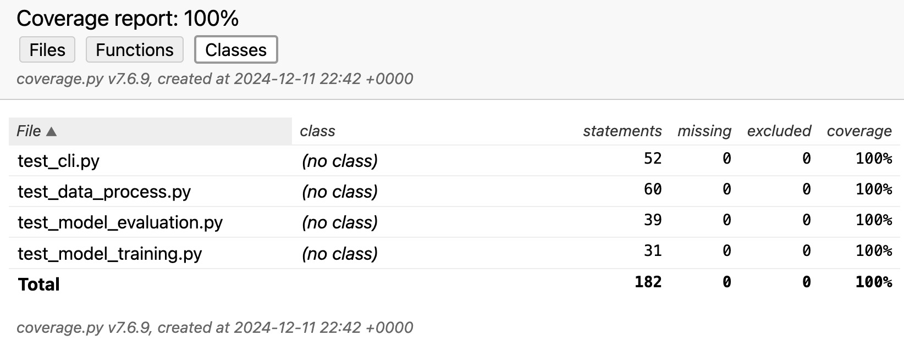
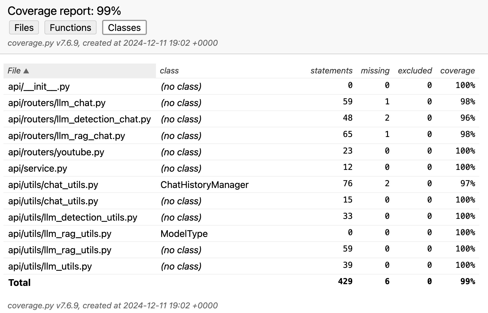

#### Integration Tests:

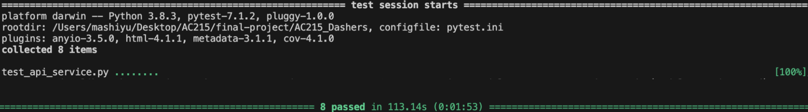

#### System Tests:

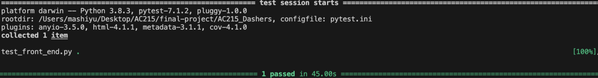

For detailed documentation on our CI/CD and testing, please refer to [Testing Documentation](tests/README.md)

### Machine Learning Workflow

We have developed a production-ready machine learning workflow including the following components: Data Processor, Model Training/Evaluation and Model Evaluation. We have also set up a CI/CD pipeline to trigger automated data processing, model retraining, and pipeline running. For detailed documentation on our machine learning workflow, please refer to [ML Documentation](src/ml-pipeline/README.md)

### Docker Containers

- [API Service](src/api-service): this container includes implementations related to the api services. [Link to Docker Hub](https://hub.docker.com/r/shiyuma/dasher_api/tags)
- [Data Versioning](src/data-versioning): this container serves the data version controls functionality. 
- [Datapipeline](src/datapieline): this container contains implementation of RAG: it prepares data for LLM with RAG, including tasks such as chunking, embedding, and populating the vector database, and output recommended recipe. [Link to Docker Hub](https://hub.docker.com/r/shiyuma/dasher_rag/tags)
- [deployment](src/deployment): this container is responsible for deployment of our application. [Link to Docker Hub](https://hub.docker.com/r/shiyuma/dasher_deploy/tags)
- [food-detection](src/food-detection): this container contains implementation for food detection functionality. [Link to Docker Hub](https://hub.docker.com/r/shiyuma/dasher_food/tags)
- [frontend_react](src/frontend_react): this container contains frontend implementations. [Link to Docker Hub](https://hub.docker.com/r/shiyuma/dasher_frontend/tags)
- [ml-pipeline](src/ml-pipeline): this container contains implementations related to machine learning workflow. [Link to Docker Hub](https://hub.docker.com/r/shiyuma/dasher_ml/tags)

We have pushed our docker images to Docker Hub. To reproduce our app, you have the option of pulling containers from Docker Hub or building them locally:
```bash
cd src/...
sh docker-shell.sh
```

### Notebooks/Reports

- [Notebook](notebooks) contains our DVC retrieval procedure, EDA for the recipe data, and the model selection insights for food detection models.
- [Reports](reports) contains different versions of our app's flowchart and a comprehensive description pdf of our project. 
- [Midterm](midterm_presentation) contains the slides for our midterm project pitch.
- [Image](images) contains all the figures used in the readme. 


