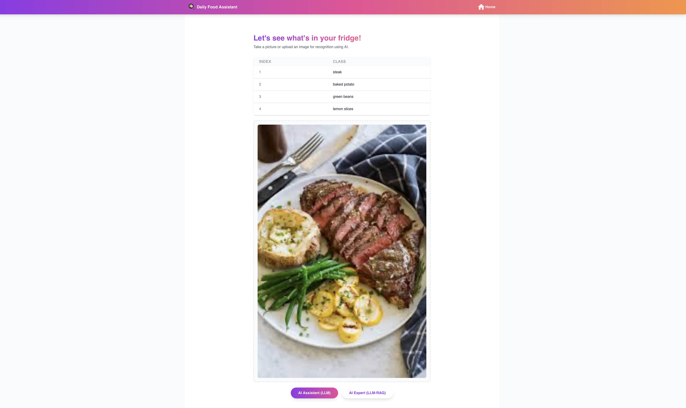
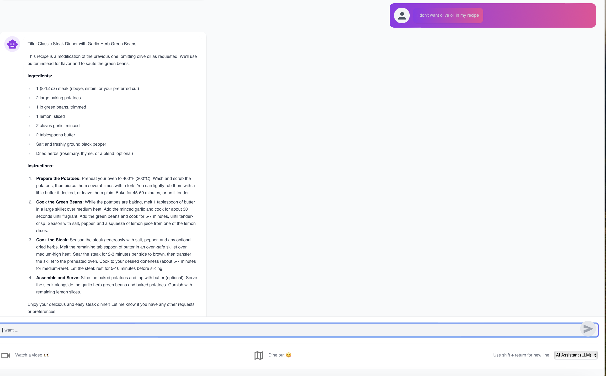

#### Project Milestone 5 Organization

```
├── .dvc
│   ├── .gitignore
│   ├── cache
│   │   └── files
│   ├── config
│   ├── config.local
│   └── tmp
│       ├── btime
│       ├── lock
│       ├── rwlock
│       ├── rwlock.lock
│       ├── updater
│       └── updater.lock
├── .dvcignore
├── .git
│   ├── COMMIT_EDITMSG
│   ├── FETCH_HEAD
│   ├── HEAD
│   ├── ORIG_HEAD
│   ├── branches
│   ├── config
│   ├── description
│   ├── hooks
│   ├── index
│   ├── info
│   │   └── exclude
│   ├── logs
│   │   ├── HEAD
│   │   └── refs
│   ├── objects
│   ├── packed-refs
│   └── refs
│       ├── heads
│       ├── remotes
│       └── tags
├── .gitignore
├── LICENSE
├── README.md
├── data
│   ├── recipe_qa.csv
│   └── recipe_qa.csv.dvc
├── midterm_presentation
│   ├── slides.pdf
│   └── slides.pptx
├── notebooks
│   ├── Object_detection_documentation.md
│   ├── container.ipynb
│   ├── dvc_retrieval.ipynb
│   ├── eda.ipynb
│   ├── fig_container
│   │   └── rag_container.png
│   ├── fig_llm_performance
│   │   ├── raw-rag3-1.png
│   │   ├── raw_rag1-1.png
│   │   ├── raw_rag1-2.png
│   │   ├── raw_rag1-3.png
│   │   ├── raw_rag2-1.png
│   │   ├── raw_rag2-2.png
│   │   └── raw_rag3-2.png
│   ├── food
│   │   ├── food1.jpg
│   │   ├── food1_gemini.png
│   │   ├── food1_gpt.png
│   │   ├── food1_mediapipe.png
│   │   ├── food1_yolov8.png
│   │   ├── food2.png
│   │   ├── food2_gemini.png
│   │   ├── food2_gpt.png
│   │   ├── food2_mediapipe.png
│   │   ├── food2_yolov8.png
│   │   ├── food3.jpg
│   │   ├── food3_gemini.png
│   │   ├── food3_gpt.png
│   │   ├── food3_mediapipe.png
│   │   └── food3_yolov8.png
│   └── llm_performance.ipynb
├── references
│   └── .gitkeep
├── reports
│   ├── Daily Meal Assistant Prototype.pdf
│   ├── Prototype_v2.pdf
│   └── Project Description.pdf
└── src
    ├── data-versioning
    │   ├── .gitignore
    │   ├── Dockerfile
    │   ├── Pipfile
    │   ├── Pipfile.lock
    │   ├── README.md
    │   ├── docker-entrypoint.sh
    │   └── docker-shell.sh
    ├── datapipeline
    │   ├── .gitignore
    │   ├── Dockerfile
    │   ├── Pipfile
    │   ├── Pipfile.lock
    │   ├── cli_rag.py
    │   ├── docker-compose.yml
    │   ├── docker-entrypoint.sh
    │   ├── docker-shell.sh
    │   ├── input-datasets
    │   ├── outputs
    │   └── requirements.txt
    ├── food-detection
    │   ├── Dockerfile
    │   ├── Pipfile
    │   ├── data
    │   ├── docker-compose.yml
    │   ├── docker-shell.sh
    │   ├── gemini-object-detection.py
    │   ├── gpt-object-detection.py
    │   └── requirements.txt
    └── secrets
        └── .gitkeep
```

# AC215 - Milestone5 - Daily Meal Assistant - "What to Eat Today"

**Team Members**

Hanqi(Hanna) Zeng(hanqizeng@hsph.harvard.edu)  <br/> 
Chris Wang(ywang3@hsph.harvard.edu)   <br/> 
Selina Qian(jingyun_qian@hsph.harvard.edu) <br/> 
Shiyu Ma(shiyuma@g.harvard.edu)  <br/> 
Cassie Dai(cdai@g.harvard.edu) <br/> 


**Group Name**
Dashers

**Project**
In this project, we aim to develop an app that serves as a personal meal assistant, helping users track their available ingredients, suggest healthy recipes, and recommend nearby restaurants based on user preferences and current inventory. The app will combine advanced AI tools like object detection and large language models (LLMs) to provide tailored meal recommendations and route suggestions for dining out. <br/>

----
### Milestone5 ###

In this final milestone, we focus on three key areas:
- Production-ready deployment with Kubernetes and Ansible.
- Project demonstration and documentation.
- Public communication of results through a live showcase.

**Application Design**

Before we start implementing the app we built a detailed design document outlining the application’s architecture. We built a Solution Architecture and Technical Architecture to ensure all our components work together.

Here is our Solution Architecture:


Here is our Technical Architecture:


**Backend API**

We built backend api service using fast API to expose model functionality to the frontend. The backend includes three APIs: the Food Detection GPT API, the LLM Chat API, and the LLM-RAG Chat API. Each of these APIs supports both GET and POST methods for fetching and storing chat histories. Below is a screenshot of the FastAPI documentation displaying all the available endpoints. To setup the API documentation, you can follow the instructions [here](#setup-instructions).


**Frontend**

A user friendly React app was built to identify various food ingredients in the photot you provided using GPT models and Gemini models from the backend. Using the app, a user can take a picture of the fridge and upload it. The app will send the image to the backend GPT api to recognize all the food ingredients. After edition and confirmation from the user, the ingredients list will be sent to the backend Gemini LLM api to generate recipes of user preference. If the user have additional requirements, the app has a chatbox to extend the conversation and provide more responses.
Essentially, there are 2 components in our App:

1. The Image Recognition Component
    In the path: /Users/qjy/Harvard/2024fall/ac215/AC215_Dashers/src/frontend_react/src/components/image
    We used ImageClassificationPredict to connect with GPT api to recognize ingredients from photos and output a list of food ingredients.
2. The LLM Chat Component
    In the path: /Users/qjy/Harvard/2024fall/ac215/AC215_Dashers/src/frontend_react/src/app/chat
    We used StartChatWithLLM to take food ingredients from the image recognition component as input and generate the recommended recipes. Then, we used ContinueChatWithLLM to generate further conversations entered by user in the chat box.
More components (chat history) will be finalized in the next milestone.


**CI and Test**

We have a functioning CI pipeline that runs on every push or merge. It does automated build process and code quality checks using linting tools (Flake8) running on GitHub Actions. Also, the CI pipeline runs automated testing by executing unit, integration, and systems tests with test results reported.

##### Continuous Integration Setup
Our project utilizes a CI pipeline that runs on every push or merge to the main branch. The pipeline is implemented using GitHub Actions and includes the following key components:

**Code Build and Linting**
The CI pipeline incorporates an automated build process and code quality checks using linting tools. The specific tools used are:
- Flake8: A Python linting tool that checks for code style and potential errors.
The linting process ensures that the codebase adheres to consistent coding standards and identifies any potential issues or violations.

**Automated Testing**
- Unit Tests: 
  - test_cli_rag.py: Tests individual functions in the cli_rag.py module, including generate_query_embedding, generate_text_embeddings, embed, load, and query. It uses mocking to isolate dependencies and ensure the functions behave as expected.
  - test_gemini_object_detection.py: Tests the identify_food_gemini function and the main function in the gemini_object_detection.py module. It checks the behavior of the functions under different scenarios, such as success and failure cases.
  - test_gpt_object_detection.py: Tests the encode_image, identify_food_gpt, and main functions in the gpt_object_detection.py module. It verifies the correct encoding of images, the functionality of the GPT object detection, and the handling of command-line arguments.
- Integration Tests(System Tests):
  - Since we only have two components, our integration tests serve the same purpose as system tests. 
  - The integration tests environment is defined in the docker-compose.yml file in the tests/integration directory.
  - In this integrated environment, the container for recipe-rag-cli service, chromadb, and food-detection service will all be run. We test the interaction between API endpoints by checking the response code of calling these APIs using our mock input to verify the interaction and integration between different application components.
  - The test results are reported within the CI pipeline, providing visibility into the success or failure of each test run.

    

**Automated Testing Implementation**
The specific testing frameworks and tools used are:

- pytest: A powerful and flexible testing framework for Python.

The tests are organized into separate directories based on their type:

- tests/datapipeline: Contains unit tests for the data pipeline component.
- tests/food-detection: Contains unit tests for the food detection component.
- tests/integration: Contains environment for integration(system) tests that run containers for all components.
- tests/system: Contains integration(system) tests script that verifies the interaction between different components.
  
**Test Coverage Reports**
Our project aims to maintain a minimum code coverage of 50%. The coverage reports are generated using the pytest-cov plugin and are included in the CI pipeline output.


##### Run Tests Manually
1. Ensure that you have Python installed on your system.
2. Clone the project repository
3. Navigate to the project directory/test/integration, run ```sh docker-shell.sh```
   This will run all the tests located in the tests/ directory and its subdirectories.
4. To generate a coverage report, type the following command:
   ```pytest --cov=src/ --cov-report=html <YOUR PATH TO THE TEST FILE>```
    This will run the tests and generate an HTML coverage report. You can view the generated html coverage report in a web browser.

## Machine Learning Workflow
We have developed a production-ready machine learning workflow including the following components: Data Processor, Model Training/Evaluation and Model Evaluation. We have also set up a CI/CD pipeline to trigger automated data processing, model retraining, and pipeline running. For detailed documentation on our machine learning workflow, please refer to [ML Documentation](src/ml-pipeline/README.md)

## Prerequisites and Setup Instructions
Several prerequisites:
- Several secrets and keys: `llm-service-account.json`, `gcp-service.json`, `openai-key.json`
- HavenNeccessary roles and APIs enabled on GCP service account
- Public SSH keys: `ssh-key-deployment.pub`

### SSH Setup
Run the following within the `deployment` container:
```sh
gcloud compute project-info add-metadata --project brilliant-lens-421801 --metadata enable-oslogin=TRUE
# Provide SSH key for service account
cd /secrets
ssh-keygen -f ssh-key-deployment
cd /app
# Provide public SSH key to instances
gcloud compute os-login ssh-keys add --key-file=/secrets/ssh-key-deployment.pub
```
From the output of the above command, keep note of the username, and paste it to `inventory.yml` within `src/deployment` folder.

### Local Development Setup
#### Build Recipe Vector Database
```bash
# Navigate to src/datapipeline directory:
cd src/datapipeline
# Build container and go to the docker shell
sh docker-shell.sh
# Run cli_rag.py within shell to download recipe vector database and build Chromadb
python cli_rag.py --download --load
```
Note: Keep this container running while proceding to the next container.
#### Run API Server
```bash
# Navigate to src/api-service
cd src/api-service
# Build container and go to the docker shell
sh docker-shell.sh
# Start server
uvicorn_server
```
Note: Keep this container running while proceding to the next container.
#### Run Frontend 
```bash
# Navigate to src/frontend_react
cd src/frontend_react
# Build container and go to the docker shell
sh docker-shell.sh
# Start frontend
npm install
npm run dev
```

## Deployment instructions
### GCP Virtual Machine Deployment
Navigate to `src/deployment` folder. Then:
```sh
sh docker-shell.sh
# Upload docker images to Google Cloud Registra, if running the procedure for the first time
ansible-playbook deploy-register-docker-images.yml -i inventory.yml
# Create GCP Virtual Machine compute instance 
ansible-playbook deploy-create-instance.yml -i inventory.yml --extra-vars cluster_state=present
```
Once the command runs successfully get the IP address of the compute instance from GCP Console and update the `appserver>hosts` in `inventory.yml` file
```sh
# Provision compute instance in GCP, installing and setting up required things for deployment
ansible-playbook deploy-provision-instance.yml -i inventory.yml
# Set up docker containers in the compute instance
ansible-playbook deploy-setup-containers.yml -i inventory.yml
# Set up webserver on compute instance
ansible-playbook deploy-setup-webserver.yml -i inventory.yml
```
You can use the below command to view the `EXTERNAL IP` of the your VM, and go to `http://<EXTERNAL IP>/` to view your website.
```sh
gcloud compute instances list
```
**Remember** to delete the compute instance if you don't need the compute instance later.
```sh
ansible-playbook deploy-create-instance.yml -i inventory.yml --extra-vars cluster_state=absent
```
### Kubernetes Deployment
After pushing all docker images to GCR as in the last step, run the following code to setup kubernetes cluster and deploy all containers
```sh
# Set up a kubernetes cluster
ansible-playbook deploy-k8s-create-cluster.yml -i inventory.yml --extra-vars cluster_state=present
# Deploy containers on kubernetes cluster
ansible-playbook deploy-k8s-setup-containers.yml -i inventory.yml --extra-vars cluster_state=present
```
Copy the `nginx_ingress_ip` from the terminal from the create cluster command, and go to `http://<nginx_ingress_ip>.sslip.io` to view the website.
**Remember** to delete the kubernetes cluster if you don't need it later.
```sh
ansible-playbook deploy-k8s-create-cluster.yml -i inventory.yml --extra-vars cluster_state=absent
```


## Usage details and examples
We have deployed our application at http://35.188.13.243/ for all users to try out. 

To run the application locally, please refer to the Prerequisites and Setup Instructions above.

Our application offers a smart solution for daily meal planning from a single image. Key features include:

- Ingredients Detection: Automatically identify ingredients in the uploaded image.
- Recipe Generation: Generate personalized recipes based on detected ingredients.
- Interactive AI Chat Agent: Allow user to refine and customize generated recipes through an intuitive chat interface with our AI agent.
- Video Demonstration: Provide users with option to watch step-by-step video instructions for cooking the generated recipes.
- Restaurant Search: Allow users to search for nearby restaurants instead if they are not in the mood to cook.

Our platform is designed to streamline the cooking experience, whether users are looking to create a meal from scratch or dine out conveniently.

### Example Usage:

#### Example 1: The start of the page: click on "Get Started" to go to the image upload page.


Upload an image of a refridgerator filled with raw ingredients:


See the list of detected results here. We have two AI assistants to choose from: the LLM without RAG and LLM with RAG; this time we can try the LLM without RAG, click on the "AI Assistant(LLM)" and proceed:


get recipe in the chat box page, check the generated recipe and detail use of ingredients:


Click on the 'Watch a Video' button on the buttom left corner of the chat page above, get the searched results for youtube videos and blog posts related to the generated recipe (you can always click reload below to get more search results):


Click on the first search result link, and watch the video on youtube about how to make your dish: 


Example 2: The start of the page: click on "Get Started" to go to the image upload page.


Upload an image of a dish to learn the ingredients and how to cook it:



See the identified ingredients here and click on the AI assistant to proceed:

Get recipe in the chat box page, check the generated recipe and detail use of ingredients:


Continue chatting with the AI assistant to refine the recipe based on your personal preference:





If you do not feel like cooking yourself, click on the Dine Out Button at the bottom of the chat page and you will be able search for restaurants on Google Map as below 


## Known issues and limitations
Here are a few limitations we've identified in the current version of our application:
 1. Geolocation Restrictions: The deployed public website currently cannot directly retrieve the user's real-time location when using the Google Maps function. However, running the application locally enables accurate location retrieval.
 2. RAG LLM Flexibility: We've observed that the RAG-empowered LLM can sometimes be less flexible due to its reliance on a specific database. To address this, we plan to implement customized databases for each user to enhance the accuracy and relevance of RAG-based suggestions in the future.
 3. User Preference Profiling: While we track user preferences to some extent through chat history, we haven't yet implemented a comprehensive system to build a holistic preference profile for each user at the start of a new chat. This can lead to less ideal initial recipe suggestions, requiring more interaction between the user and the AI assistant to refine the recommendations.


## Docker Containers 
- [API Service](src/api-service): this container implementations related to the api services
- [Data Versioning](src/data-versioning): this container serves the data version controls functionality.
- [Datapipeline](src/datapieline): this container contains implementation of RAG: it prepares data for LLM with RAG, including tasks such as chunking, embedding, and populating the vector database, and output recommended recipe.
- [deployment](src/deployment): this container is responsible for deployment of our application. 
- [food-detection](src/food-detection): this container contains implementation for food detection functionality.
- [frontend_react](src/frontend_react): this container contains frontend implementations.
- [ml-pipeline](src/ml-pipeline): this container contains implementations related to machine learning workflow 

<hr style="height:2px;border-width:0;color:gray;background-color:gray">
Run docker container by 

```cd src/...```

```chmod +x docker-shell.s```

```sh docker-shell.sh```

<hr style="height:2px;border-width:0;color:gray;background-color:gray">


----

**Notebooks/Reports**
This folder contains code that is not part of container - for e.g: Application mockup, EDA, any 🔍 🕵️‍♀️ 🕵️‍♂️ crucial insights, reports or visualizations.

