## Object Detection Model Selection

We decide to incorporate an object detection model to identify food from the picture uploaded by user. We have experimented with object detection models including MediaPipe['https://ai.google.dev/edge/mediapipe/solutions/vision/object_detector'] and a pretrained food detection model using YOLOV8 as backbone['https://github.com/lannguyen0910/food-recognition']. We also experimented with LLMs that also accept images as input including  GPT-4o and gemini-1.5-flash. For our initial inspection, we used 10 images containing various food and input them into different models to compare the detection results manually.  For MediaPipe and YOLOV8, we directly input the images and check the outputs; for LLMs, we used the image as well as the text "Can you  list the name of food in the picture?" as input. Below we show the results from 3 images. We observed that both LLMs outperforms the two object detection models significantly as MediaPipe and YOLOv8 can only identify a very limited set of food. We also observe that LLM has the ability to recognize the food not only from the appearance of food itself, but also utilizes useful information such as packaging (see image 3 below: the image doesn't explicily show eggs but LLM was able to infer it from the carton). Therefore, we eventually decided to utilize LLM for our food detection task.Since both GPT-4o and gemini-1.5-flash work quite well, we will make our final decision later after acquiring more labeled food images and constructing a test set to quantitatively evaluate the performance of models.

### Input Image 1
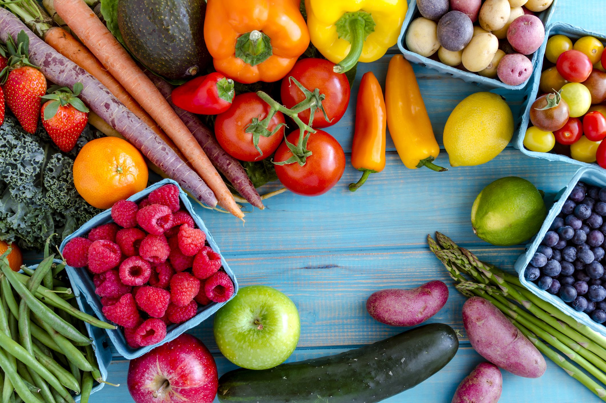

#### Mediapipe Result
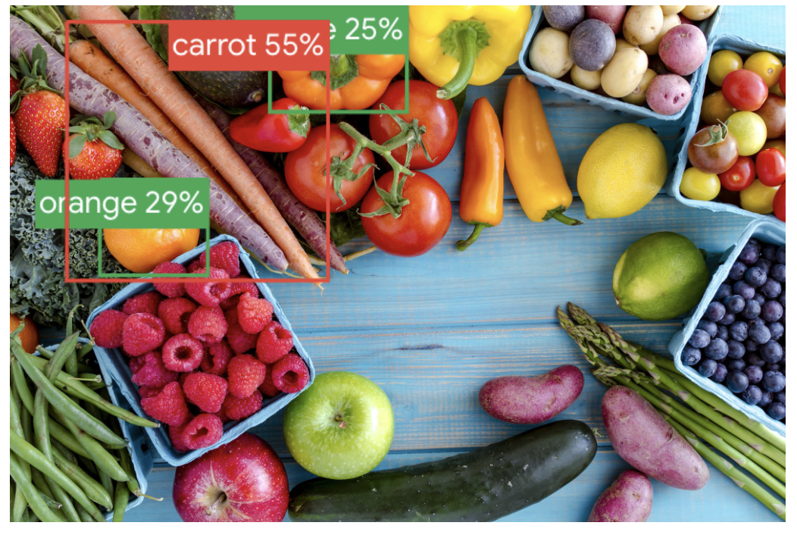

#### YOLOv8 Result

#### GPT Result
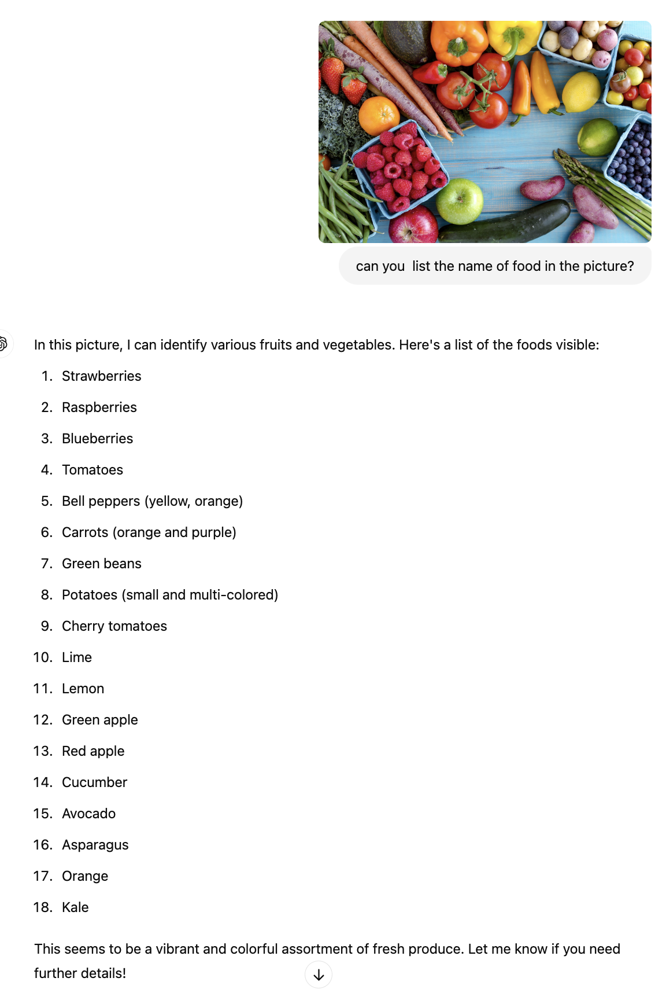

#### Gemini Result
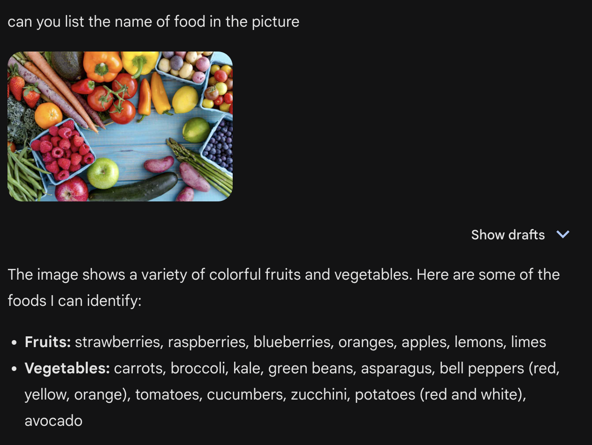

### Input Image 2
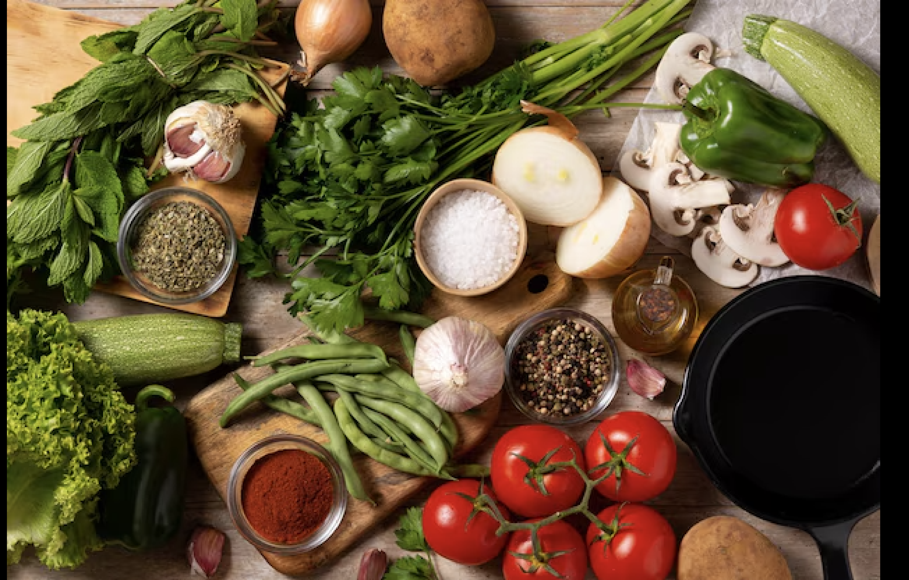

#### Mediapipe Result
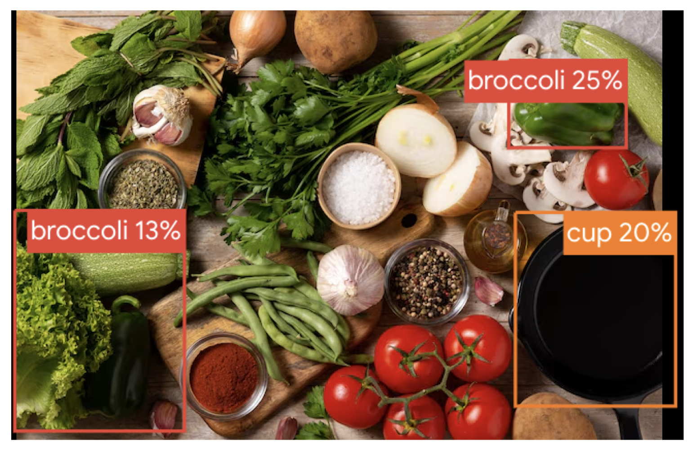

#### YOLOv8 Result

#### GPT Result
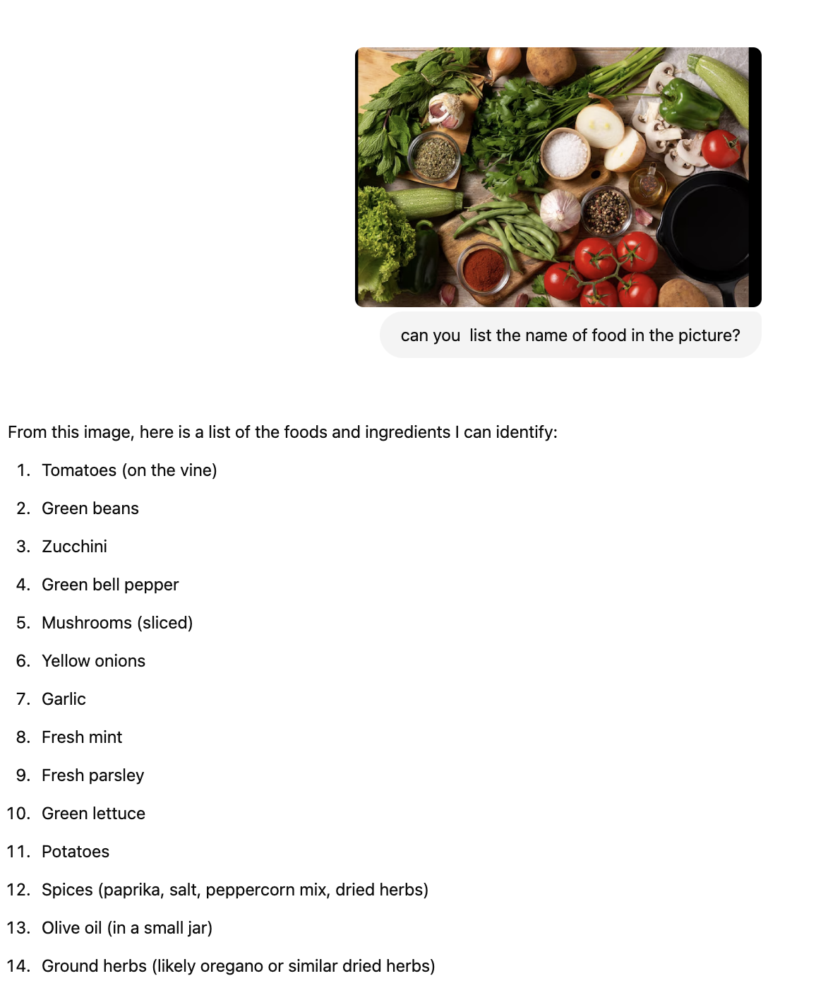

#### Gemini Result
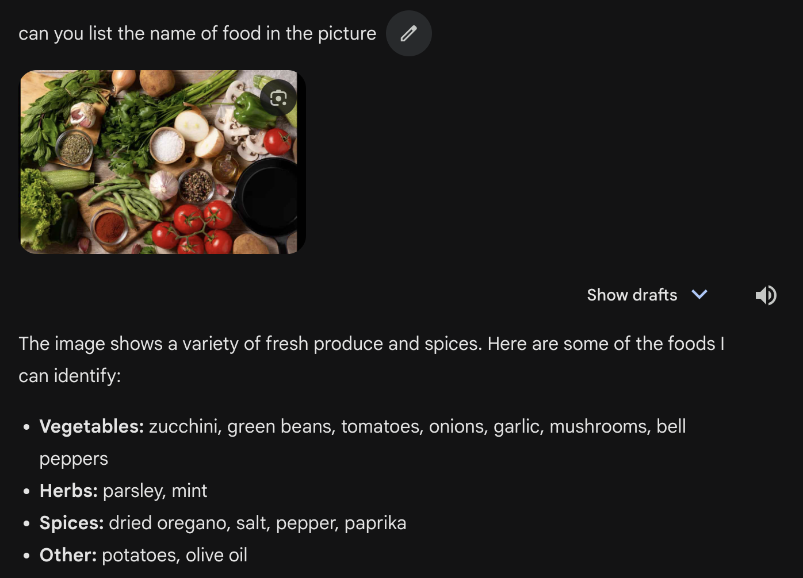

### Input Image 3

#### Mediapipe Result
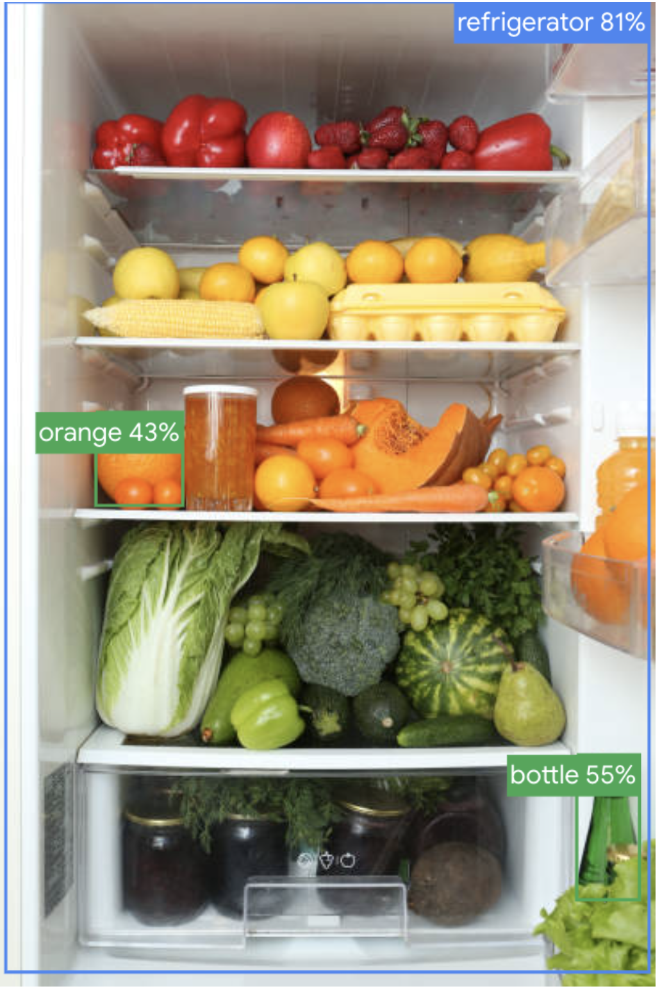

#### YOLOv8 Result
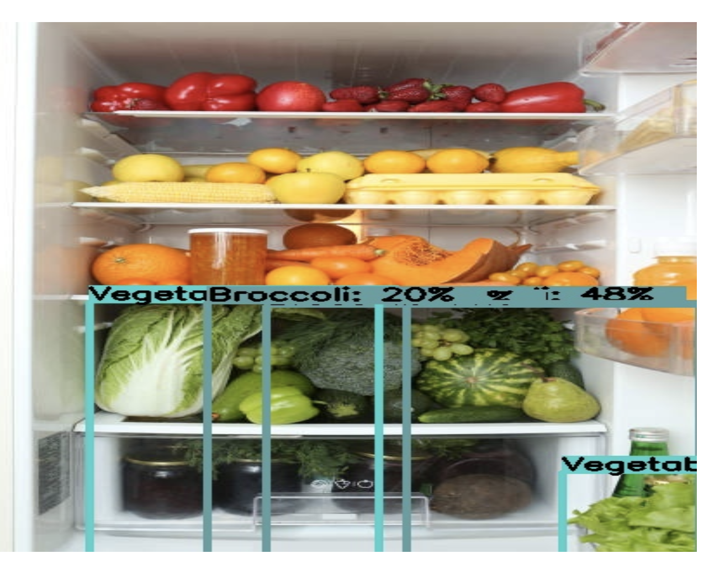

#### GPT Result
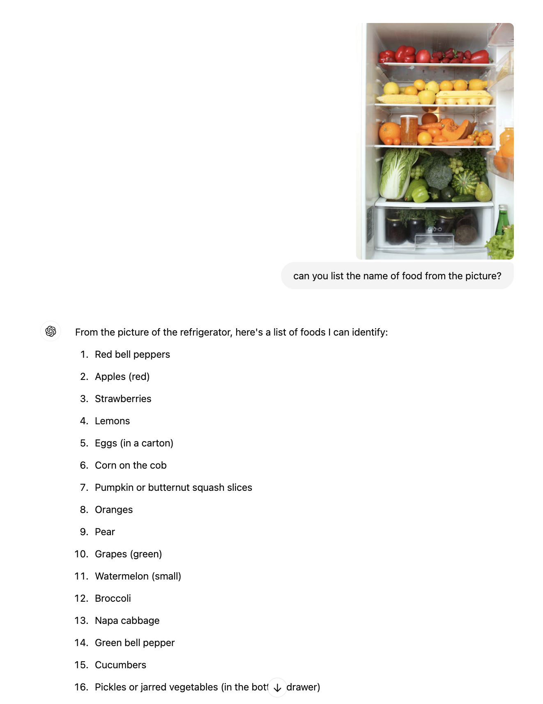

#### Gemini Result
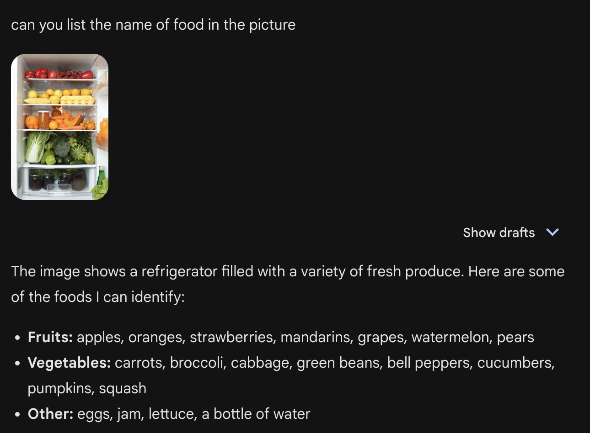
