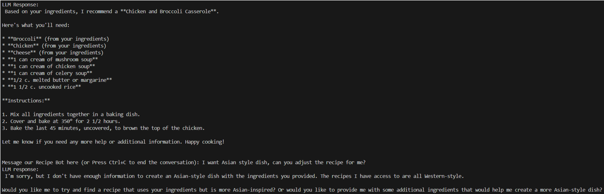
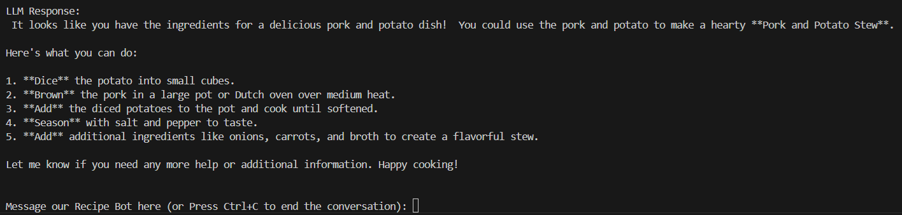
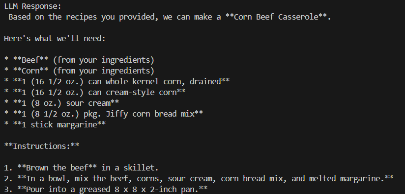

## Raw Gemini model's performance

Since our model performs generative tasks, we currently lack quantitative metrics to evaluate the model. However, we plan to conduct human quanlitative evaluation of our model's performance. Below are the experiment logs of our model's generated texts. We will systematically evaluate these experiment results after collecting more sample responses. For example, we can give scores to evaluate on recipe's relatedness to user's need (calory, healthyness, styles etc.), text formatting and grammar. 

### Test Case 1

### Test Case 2

### Test Case 3

### Test Case 4: with finetuned model

**Prompt: Input ingredients the user has: {query_input}, create a recipe**

Sample recipe:
Title: Chicken Casserole
Ingredients: ["1 can cream of mushroom soup", "1 can cream of chicken soup", "1 can cream of celery soup", "1 cut up chicken", "1/2 c. melted butter or margarine", "1 1/2 c. uncooked rice"]
Directions: ["Mix all ingredients together in baking dish.", "Cover and bake at 350\u00b0 for 2 1/2 hours.", "Bake the last 45 minutes, uncovered, to brown top of chicken."]
Input ingredients the user has: [broccoli, chicken, cheese], create a recipe

LLM Response:
 
Chicken Divan
1/4 cup margarine
1/4 cup chopped onion (or as much as you want)
Chopped celery to taste
1/4 cup flour
1/8 teaspoon curry powder
1 can sliced mushrooms (save juice)
1 can cream of celery soup
1 package chopped broccoli
1 cubed chicken
Shredded Monterey Jack cheese

Melt margarine in skillet; saute onions and celery. Remove from heat. Stir in flour and curry powder. Drain mushrooms and keep juice. Add water to juice to make 1/2 cup liquid. Stir liquid and soup into flour mixture; add mushrooms. Cook until thick. Arrange broccoli and cubed chicken in a large baking dish. Spoon sauce over chicken. Top with grated cheese. Bake in a 350° oven for about 20 minutes or in microwave until cheese is melted.

**Prompt: How can I make a dish from these ingredients: {query_input}?**
How can I make a dish from these ingredients: [broccoli, chicken, cheese]?

LLM Response:
 Cook broccoli until tender-crisp. Drain. Mix with cooked, cubed chicken and cheese. Pour cream of mushroom soup over mixture. Bake at 350\u00b0 for 30 minutes.