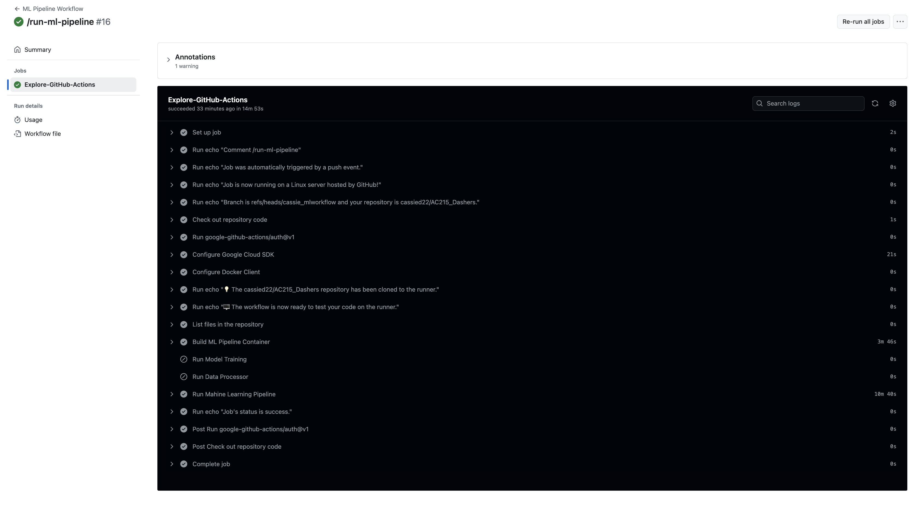
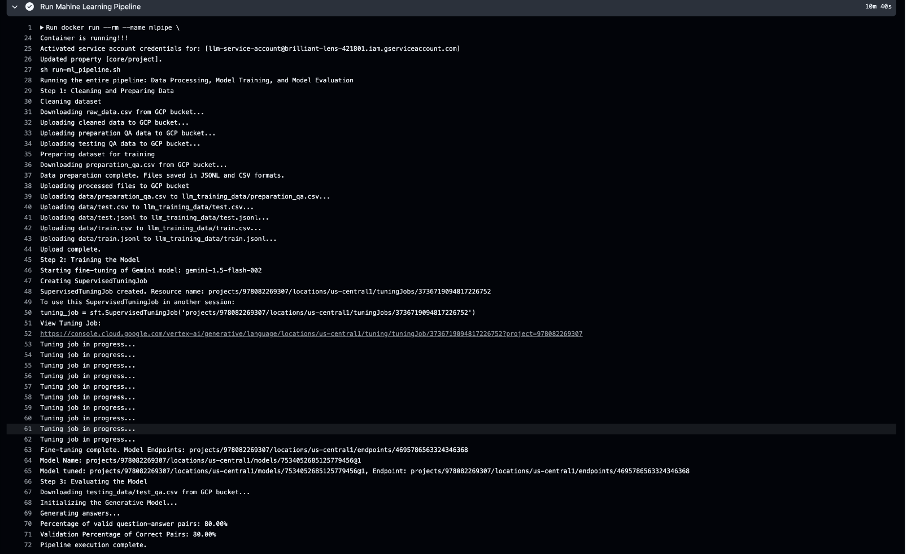
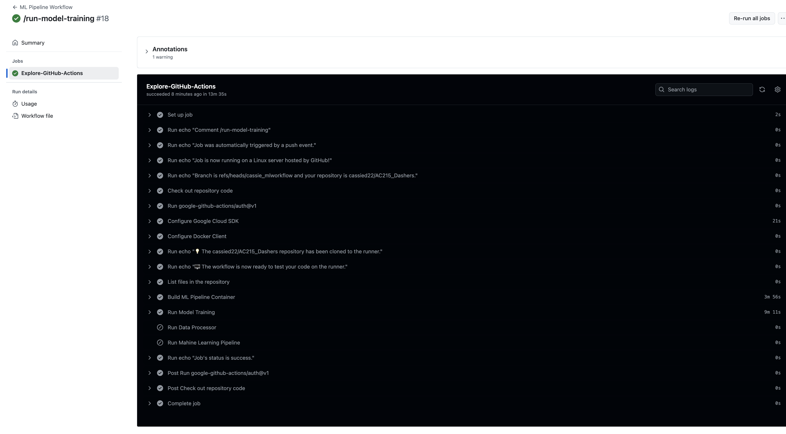
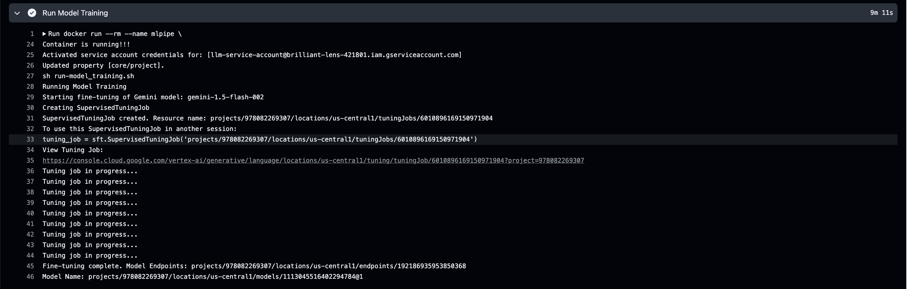
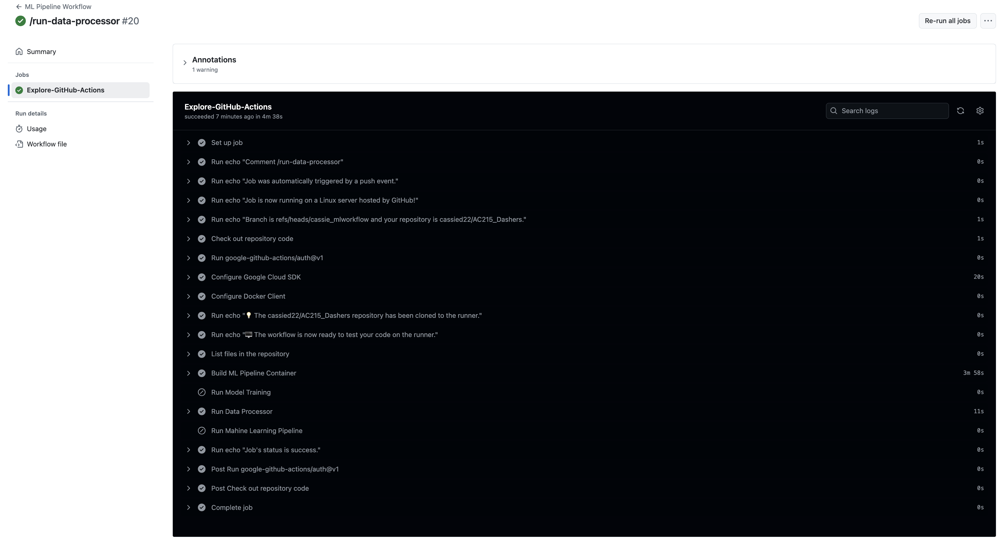
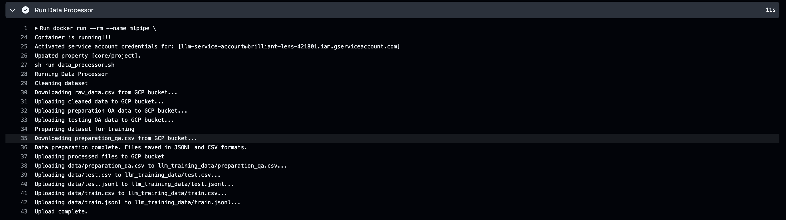
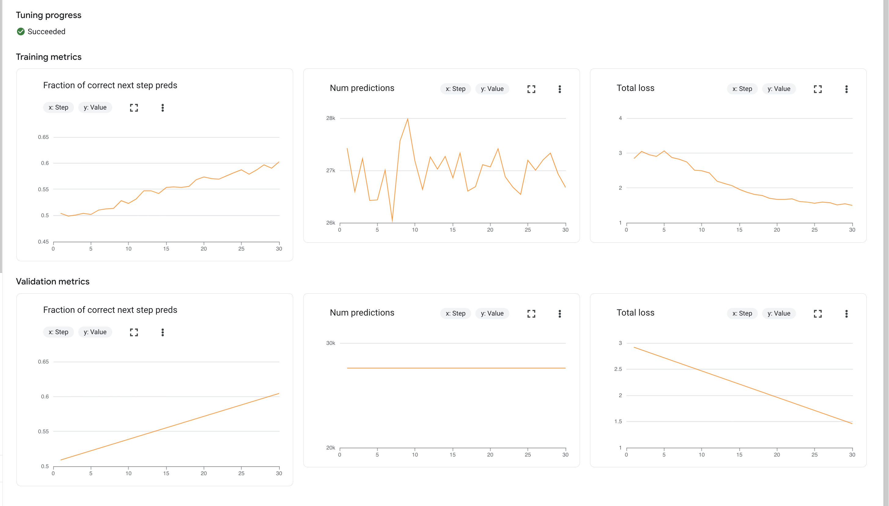
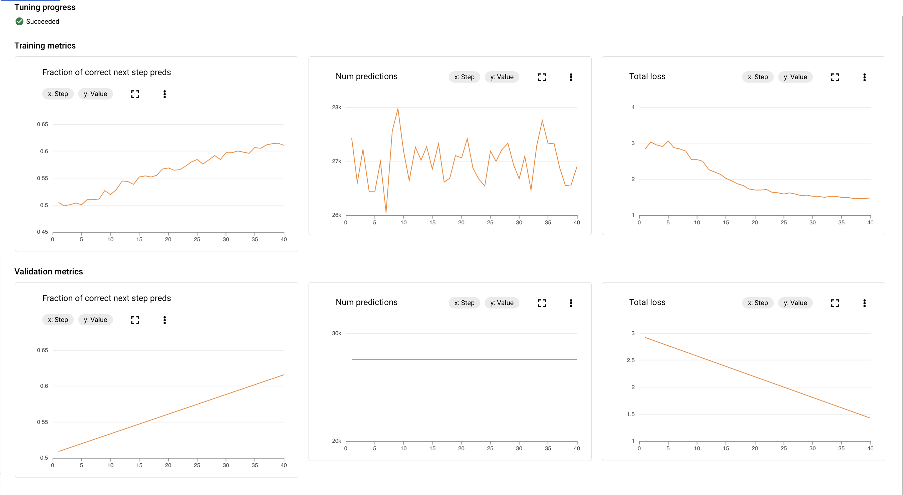

# Machine Learning Workflow

This module focus on the Machine Learning workflow, which contains the following main conponents: Data Processor, Model Training/Deployment, Model Evaluation. 

# Setup Instructions

- Run docker container in this folder by using:
```chmod +x docker-shell.sh```
```sh docker-shell.sh```

- Run Data Processor in the Docker Container by using:
```python cli.py --data_processor```

- Run Model Training/Deployment in the Docker Container locally by using:
```python cli.py --model_training```

- Run Model Evaluation using our custom metric(explained later) in the Docker Container locally by using:
```python cli.py --model_evaluation```

- Run Entire Machine Learning Pipeline (including data process, model training/devlopment, and eveluation) locally by using:
```python cli.py --pipeline```

<hr style="height:2px;border-width:0;color:gray;background-color:gray">
Please noted that during our model training step, since we are finetuning the gemini model in Vertex AI using SupervisedTuningJob, the model will get automatically deployed to an endpoint on vertex AI upon the completion of the training job. Therefore we did not have a separate function for model deployment.
<hr style="height:2px;border-width:0;color:gray;background-color:gray">


# Automated Data Processing, Model Training/Deployment and Machine Learning Pipeline  in github action
We have set up the CI/CD pipeline to automate the machine learning workflow in github action. [Workflow file](../../.github/workflows/ml-pipeline.yml)

To run Machine Learning Pipelines on updates to the codebase, add the following to code commit comment to the `main` branch:
* Add `/run-ml-pipeline` to the commit message to run the entire ML pipeline
* Add `/run-model-training` to the commit message to run the model training/deployment
* Add `/run-data-processor` to the commit message to run the data processor 

# Screenshot of Successful Data Processing, Model Training/Deployment, Machine Learning Pipeline workflow runs
### Machine Learning Pipeline



### Model Training



### Data Processor



# Documentation on details of ML Pipeline

## Data Processor:
For data processing, we performed the following steps
1. **Data Collection**: download the raw recipe data (original source: https://recipenlg.cs.put.poznan.pl/), which has been previously uploaded to GCP bucket. The original dataset consisted of recipes with titles, ingredients, and preparation directions.
2. **Data Cleaning**:perform data cleaning by removing duplicates and nulls. Save the first 6000 rows for model training/evaluaions and upload to GCP.
3. **Question-Answer Pair Creation***: we generate question-answer pairs for finetuning gemini models by creating questions such as "Can you give me a recipe using these ingredients: [ingredients ]?" and setting the corresponding recipe title and preparation instructions as the answer.
   - Example Question-Answer Pair:
        - Question: ""Can you give me a recipe using these ingredients: [""shortening"", ""sugar"", ""egg"", ""pumpkin"", ""vanilla"", ""flour"", ""baking powder"", ""baking soda"", ""cinnamon"", ""salt"", ""raisins""]?""
        - Answer: "With those ingredients, we can make a Pumpkin Cookies! Here are the step-by-step instructions: [""Mix together shortening and sugar until creamy."", ""Add egg, pumpkin and vanilla and blend."", ""Combine all dry ingredients and blend into batter a little at a time."", ""Add raisins or nuts."", ""Bake at 350\u00b0 for 10 to 12 minutes.""]"
4. **Data Split**: We first save the last 1000 QA pairs for our customized evaluation metric which will be explained below. Then for the first 5000 pairs, we will use it for Vextex AI pipeline: We split it into training and test sets using a 90/10 split ratio, ensuring that 10% of the dataset was held out for testing.
5. **Data Upload**: We then save all the datasets and upload to GCP bucket.  

## Model Training/Deployment:
The fine-tuning process was executed on Google Cloud Platform (GCP) using Vertex AI. The finetuned models are automatically deployed to an endpoint in Vertex AI when the training job is completed. We keep track/return the final endpoints for further eveluations.
We have experimented with different configurations/hyperparameters, and we present two finetuning confugirations/process below.

### Model 1: food-planner-finetuned-v1
generation_config = {
    "max_output_tokens": 3000, 
    "temperature": 0.75,  
    "top_p": 0.95, 
}
hyperparameter= {
        source_model='gemini-1.5-flash-002',
        epochs=3,
        adapter_size=4,
        learning_rate_multiplier=1.0,
        tuned_model_display_name="food-planner-finetuned-v1"
}



From the training image of model 1, we observed that both training and validation losses are decreasing steadily, which suggest that the model might benefit from additional epochs. Therefore, for the second trial, we increase number of epochs to 4 and also slightly decrease the learning rate to 0.9 to avoid overfitting. 


### Model 2: food-planner-finetuned-v2
generation_config = {
    "max_output_tokens": 3000,  # Maximum number of tokens for output
    "temperature": 0.75,  # Control randomness in output
    "top_p": 0.95,  # Use nucleus sampling
}
hyperparameter= {
        source_model='gemini-1.5-flash-002',
        epochs=4,
        adapter_size=4,
        learning_rate_multiplier=0.9,
        tuned_model_display_name="food-planner-finetuned-v1"
}



## Model Evaluation
We evaluate our model through three main methods:
First, we visually check the validation metrics(include Fraction of correct next step preds and total loss) that are automatically generated and recorded during the Vertex AI finituning process as shown in the pictures above. 

We then manually test the output of the finetuned models. For example, when we asked the Model 2:food-planner-finetuned-v2 above:"
Can you give me a recipe using these ingredients: [""salt"", ""flour""]", it responds with: "With those ingredients, we can make a salt dough! Here are the step-by-step instructions: ["Mix dry ingredients well, then add salt water to form a dough.", "Roll out on floured board and cut with cutters.", "Bake for 1 1/2 to 2 hours."], which looks valid.

Lastly we customized our own evaluation metric to assess the relavancy of generated recipe providing a list of ingredients (implementations in`model_evaluation.py`). We take the questions from question-answer pairs in the testing test as prompts and use finetuned model to generate recipes; then we compute the percentage of provided ingredients that appears in the generated recipe: the generated recipe which contains more than 50% of provided ingredients were considered valid. We then compute the percentage of valid recipes among all rows and output such percentage as an evaluation metric. We found that the Model 2: food-planner-finetuned-v2 shown above gives the highest percentage of valid recipes of 80%, and decided to adopt this model.

## Machine Learning Pipeline
Our machine learning pipeline integrates all components listed above. 


