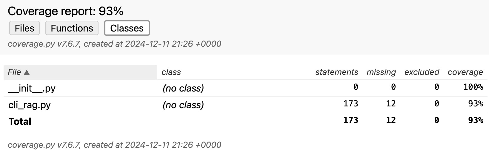
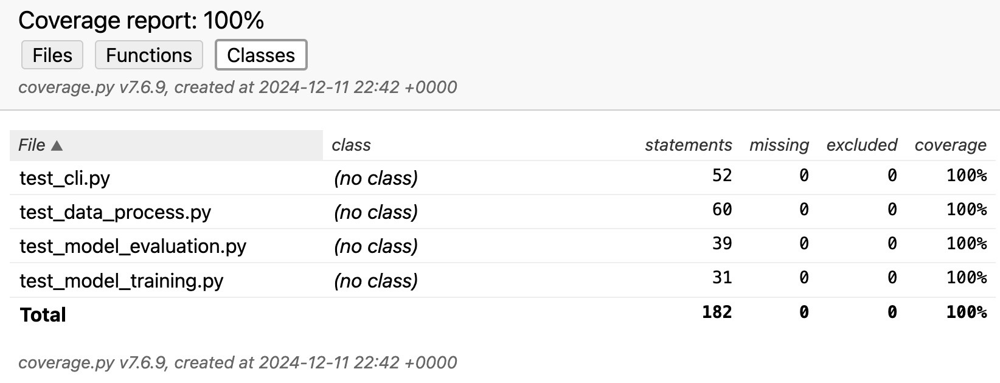
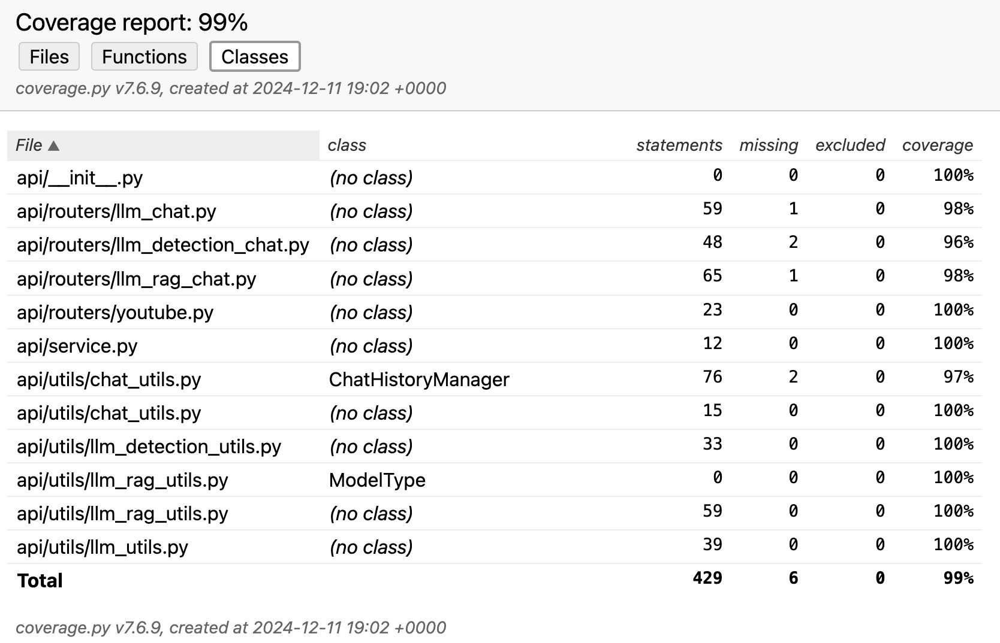
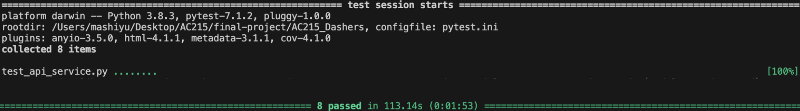

## Testing & CI
Our project utilizes a CI pipeline that runs on every push or merge to the main branch. The pipeline is implemented using GitHub Actions and includes the following key components:

### Code Build and Linting
The CI pipeline incorporates an automated build process and code quality checks using linting tools. The specific tools used are:
- Flake8: A Python linting tool that checks for code style and potential errors.
The linting process ensures that the codebase adheres to consistent coding standards and identifies any potential issues or violations.

### Automated Testing
The specific testing frameworks and tools used are:

- pytest: A powerful and flexible testing framework for Python.

The tests are organized into separate directories based on their type:

- Unit tests: Testing the functionality of each component in isolation
  - tests/datapipeline
  - tests/food-detection
  - tests/ml-pipeline
  - tests/api-service
- Integration(System) test: Testing the interaction between different components
  - tests/integration

### Unit Tests: 
#### datapipeline
  - **tests/datapipeline/test_cli_rag.py**: Tests all the functions in **src/datapipeline/cli_rag.py**. It validates the functionality of a CLI-based recipe recommendation system by mocking external dependencies and ensuring correct behavior for core operations like embedding generation, data loading, querying, chatting, downloading, and argument parsing.
#### food-detection
  - **tests/food-detection/test_gemini_object_detection.py**: Tests all the functions in **src/food-detection/gemini_object_detection.py**, including identify_food_gemini and the main function. It tests the Gemini-based object detection system by mocking API configuration, file handling, and command-line inputs to validate correct functionality and error handling.
  - **tests/food-detection/test_gpt_object_detection.py**: Tests all the functions in **src/food-detection/gpt_object_detection.py**, including encode_image, identify_food_gpt, and main functions. It verifies the functionality of a GPT-based object detection system by mocking file handling, external API calls, and command-line inputs to ensure correct behavior for image encoding, API requests, and program execution with various scenarios.
#### ml-pipeline   
  - **tests/ml-pipeline/test_{...}.py**: There are 4 test scripts in this folder, corresponding to each Python script in the **src/ml-pipeline**:
    - **tests/ml-pipeline/test_cli.py.py**: validates the functionality of **src/ml-pipeline/cli.py** by testing individual components such as UUID generation, data processing, model training, and evaluation through mock objects.
    - **tests/ml-pipeline/test_data_process.py**: tests the functionality of **src/ml-pipeline/data_process.py** by mocking GCP storage interactions, file operations, and data transformations to validate the behavior of clean, prepare, and upload functions.
    - **tests/ml-pipeline/test_model_evaluation.py**: tests **src/ml-pipeline/model_evaluation.py**, including ingredient extraction, match percentage calculation, and valid pair computation. It validates end-to-end evaluation with mocked data, storage, and model dependencies to ensure accurate ingredient-based content generation.
    - **tests/ml-pipeline/test_model_training.py**: validates the gemini_fine_tuning function in **src/ml-pipeline/model_training.py** by mocking Vertex AI's fine-tuning process, including initialization, training, and job completion. It ensures correct parameter passing and verifies expected outputs for the tuned model and endpoint names.
#### api-service 
  - **tests/api-service/test_{...}.py**: There are 9 test scripts in this folder, corresponding to each Python script in the **src/api-service/api**:
    - **tests/api-service/test_service.py**: tests various API routes in **src/api-service/api/service.py**
    - **tests/api-service/test_youtube.py**, **tests/api-service/test_llm_chat.py**, **tests/api-service/test_llm_detection_chat.py**, **tests/api-service/test_llm_rag_chat.py** tests 4 scripts to deploy API endpoints in **src/api-service/api/routers/** by verifying API's functionality via mocking external dependencies, without making actual API calls
    - **tests/api-service/test_chat_utils.py**, **tests/api-service/test_llm_utils.py**, **tests/api-service/test_llm_detection_utils.py**, **tests/api-service/test_llm_rag_utils.py** tests 4 utils scripts in **src/api-service/api/utils/** by verifying the functionality of API utility functions, including chat session creation, query embedding generation, and response handling. It uses mocking to simulate external dependencies like models, collections, and sessions, ensuring correct behavior and error handling in functions like generate_query_embedding, generate_chat_response, and rebuild_chat_session.

    We achieved code coverage of over 90% on unit test based on the coverage report below.

    
    
    
    

### Integration Tests(System Tests):
  - The integration(system) tests environment is defined in the docker-compose.yml file in the tests/integration directory. Since our integration and system tests use the same environment, we put them both into the same file **tests/integration/test_api_service.py**. In this integrated environment, the container for recipe-rag-cli, chromadb, api-service, and food-detection service will all be run.
  - For the integration test, we test the functionality of each API endpoint by checking the response code when calling these APIs using our mock input.
  - For the system test, in **tests/integration/test_api_service::test_full_workflow**, we verify the interaction and integration between different application components by simulating a complete API calling workflow for users uploading images, getting text responses from LLM, chatting with LLM, and getting video search results from Youtube.
  - The test results are reported within the CI pipeline, providing visibility into the success or failure of each test run. 

    


### Run Tests Manually
1. Clone the project repository
2. Navigate to ./test/integration, run ```sh docker-shell.sh```
   This will run all the tests located in the tests/ directory and its subdirectories.
3. To generate a coverage report, type the following command:
   ```pytest --cov=src/ --cov-report=html <YOUR PATH TO THE TEST FILE>```
    This will run the tests and generate an HTML coverage report. You can view the generated html coverage report in a web browser.
